<div align="center">

# Vayl

<h3>The reconciling memory layer for AI agents</h3>

<samp>a new value replaces the old&nbsp;&nbsp;·&nbsp;&nbsp;"we dropped X" actually removes X&nbsp;&nbsp;·&nbsp;&nbsp;history stays queryable</samp>

<br>

[](https://pypi.org/project/vayl-mcp/)
[](https://scorecard.dev/viewer/?uri=github.com/vayl-dev/vayl)


[](https://vayl.gitbook.io/vayl-docs)

[**Quickstart**](#quickstart-2-min)&nbsp; ·&nbsp; [Why Vayl](#why-vayl)&nbsp; ·&nbsp; [Use it from code](#use-it-from-code)&nbsp; ·&nbsp; [Tools](#what-your-agent-gets)&nbsp; ·&nbsp; [How it works](#how-it-works)&nbsp; ·&nbsp; [Benchmarks](#benchmarks)&nbsp; ·&nbsp; [Contributing](#contributing)

</div>

<p align="center">
  
</p>

Most memory layers *accumulate* — they save every fact and later hand your agent stale ones. **Vayl reconciles**: a new value replaces the old one, "we dropped X" actually removes X, and you can still ask what was true *before*. Drops into any MCP client — Claude Desktop, Cursor, Claude Code.

```
"We use Redux."                             → remembered
"Actually we moved off Redux to Zustand."   → Redux retired, Zustand active
"What do we use?"                           → "Zustand"   (not "Redux, Zustand")
"What did we use first?"                    → "Redux"     (history kept)
```

**Why it's different, in four lines:**

- ✅ **Reconciles, doesn't pile up** — a new value *supersedes* the old; a *same-slot invariant* means one thing never has two live values, so "what's true now" is always unambiguous.
- 🗑️ **Removal is first-class** — "we dropped X" actually *retracts* X. Graph memory stores can't model this; additive stores never do.
- 🕰️ **History is kept and auditable** — ask what's true *now* or what was true *before*; every change is on a tamper-evident, signed audit chain.
- 🔌 **Local, cheap, pluggable** — SQLite by default (no server to run), ~2 LLM calls per fact, one-command install into Claude / Cursor / Claude Code, and it speaks MCP so any agent client plugs in.

> 📚 **Full documentation** → [vayl.gitbook.io/vayl-docs](https://vayl.gitbook.io/vayl-docs) — guides, MCP tool reference, tutorials, and deployment.

---

## Why Vayl

Two common kinds of agent memory each leave the same gap — a fact that *changed*:

|  | Additive / vector memory | Temporal-graph memory | **Vayl** |
|---|---|---|---|
| A value that changed | ranks both — model guesses which is current | reconciles | **reconciles by construction** |
| "we dropped X" | X still returned | usually **can't model removal** | **retracts X** |
| "what was true before?" | — | kept | **kept + signed audit chain** |
| Cost per fact | ~1 LLM call | graph DB + many LLM calls | **~2 LLM calls, no graph DB** |
| Runs local & free | varies | heavy | **SQLite, no server to run** |

**Honest about scope:** on a plain contradiction ("switched X → Y") a strong model reconciles well in most designs — Vayl isn't "more accurate" across the board. Its edges are **correct forgetting, low cost, current-truth by construction, and running free & local.**

**Built for** coding agents that track decisions · support copilots whose account state keeps changing · personal assistants that update preferences · and high-stakes domains (clinical, finance) where a stale fact is a hazard, not a typo. Worked examples for each are in the [docs](https://vayl.gitbook.io/vayl-docs).

---

## Quickstart (~2 min)

```bash
pip install vayl-mcp          # from PyPI
vayl-demo                     # 30s, no keys — see reconciling memory in action
```

Add to your MCP client (Claude Desktop / Cursor) config:

```json
{
  "mcpServers": {
    "vayl": {
      "command": "vayl-mcp",
      "env": {
        "LLM_PROVIDER": "openai",
        "OPENAI_API_KEY": "sk-…",
        "OPENAI_MODEL": "gpt-5-mini",
        "EMBED_BASE_URL": "https://api.openai.com/v1",
        "EMBED_MODEL": "text-embedding-3-small",
        "VAYL_DB": "/absolute/path/vayl.db"
      }
    }
  }
}
```

Restart the client — your agent now has the [tools below](#what-your-agent-gets). `VAYL_DB` is where memory persists. `gpt-5-mini` is the default and scores **0% silently-wrong** on the messy real-world suite; any OpenAI-compatible endpoint works (point `OPENAI_BASE_URL` at a self-hosted or EU-region deployment if data residency matters).

> **Models & reliable reconciliation.** For **declared slots** (a [preset](#declared-slots--presets) via `VAYL_SLOT_SCHEMA=preset:coding`) the same-slot invariant retires the old value *deterministically* — even a small local model reconciles a switch correctly. For **free-form** memory (no preset), use a capable model (the default `gpt-5-mini`, or a ~7B+ local model) so the extractor names slots consistently. A 3B local model works, but is less reliable without a preset.

**Or let the CLI write the config for you.** Vayl is a [FastMCP](https://gofastmcp.com) server, so `fastmcp install` wires it into your client in one command:

```bash
fastmcp install claude-desktop src/vayl/api/mcp_server.py:mcp \
  --with vayl-mcp --env OPENAI_API_KEY=sk-… --env VAYL_DB=/absolute/path/vayl.db
```

Targets: `claude-desktop` · `claude-code` · `cursor` · `gemini-cli` · `mcp-json` (prints the config JSON for any client).

---

## Use it from code

A small client wraps the MCP boilerplate, so you write methods, not `tools/call` JSON.

```python
from vayl import Vayl

with Vayl(user_id="proj_7") as m:        # local: spawns vayl-mcp over stdio
    m.remember("We moved off Redux to Zustand")
    print(m.recall("what do we use for state?"))   # -> "Zustand"

# a shared team server:
# with Vayl(url="https://memory.acme.com/mcp", api_key="vayl_sk_…") as m: ...
```

Any tool is callable as a method (`m.history(...)`, `m.check_before_act(...)`); a default `user_id`/`agent_id`/`run_id` is sent on every call. **TypeScript:** the same client for TS/JS agents — `npm i @vayl.dev/client`, source in [`clients/typescript/`](clients/typescript/).

### Framework integrations

Drop Vayl's reconciling memory into an existing agent framework as tools it can call — so a plain vector store's "hands you back both Redux and Zustand" problem just goes away. Every adapter exposes the same curated surface (`remember` · `recall` · `history` · `forget` · `list_memories`) and binds your scope server-side, so the model never sets whose memory it touches.

| Framework | Install | Import |
|---|---|---|
| **LangGraph / LangChain** | `pip install 'vayl-mcp[langgraph]'` | `from vayl.integrations.langgraph import VaylMemory` |
| **OpenAI Agents SDK** | `pip install 'vayl-mcp[openai-agents]'` | `from vayl.integrations.openai_agents import VaylMemory` |
| **CrewAI** | `pip install 'vayl-mcp[crewai]'` | `from vayl.integrations.crewai import VaylMemory` |
| **Vercel AI SDK** (TS) | `npm i @vayl.dev/client ai zod` | `import { vaylTools } from "@vayl.dev/client/vercel"` |
| **Mastra** (TS) | `npm i @vayl.dev/client @mastra/core zod` | `import { vaylTools } from "@vayl.dev/client/mastra"` |

```python
# Python — LangGraph / OpenAI Agents / CrewAI all follow this shape
from vayl.integrations.langgraph import VaylMemory

with VaylMemory(user_id="proj_7") as mem:
    agent = mem.agent("openai:gpt-4o-mini")          # ready agent wired to memory
    agent.invoke({"messages": [("user", "We moved off Redux to Zustand. What do we use now?")]})
    # or bind the tools onto your own agent: create_agent(model, tools=mem.tools())
```

```ts
// TypeScript — Vercel AI SDK (Mastra is the same, from "@vayl.dev/client/mastra")
import { generateText, stepCountIs } from "ai";
import { openai } from "@ai-sdk/openai";
import { Vayl } from "@vayl.dev/client";
import { vaylTools } from "@vayl.dev/client/vercel";

const m = await Vayl.connect({ userId: "proj_7" });
const { text } = await generateText({
  model: openai("gpt-4o"),
  tools: vaylTools(m),
  stopWhen: stepCountIs(5),
  prompt: "We moved off Redux to Zustand. What do we use now?",
});
```

---

## What your agent gets

Vayl exposes **30+ MCP tools**, grouped by the job they do:

| Group | Tools | For |
|---|---|---|
| **Memory** | `remember` · `recall` · `history` · `update_memory` · `forget` · `list_memories` | store, query, correct, and time-travel over facts |
| **Safety** | `check_before_act` · `safe_recall` · `pending_changes` · `confirm_change` / `reject_change` | gate irreversible actions; human approval for high-stakes writes |
| **Accountability** | `record_decision` · `explain_decision` · `attest` · `audit_log` · `verify_audit` | signed, tamper-evident record of what the agent believed and did |
| **Compliance (GDPR)** | `delete` · `delete_all` · `export_memory` · `purge_expired` · `verify_receipt` | erasure, DSAR export, retention — with signed receipts |
| **Team / admin** | `create_principal` · `set_reconcile_policy` · `license_status` · `stats` · `health` | multi-tenant scoping, conflict policy, ops |

`forget` vs `delete`: **forget** retires a fact but keeps it in history (the auditable "we used to use X"); **delete** hard-erases it for compliance. Both matter — one for correctness, one for privacy. Every tool carries MCP **safety annotations**, so clients can auto-run the reads (`recall`, `history`, …) and confirm before an irreversible erasure (`delete`, `delete_all`, `purge_expired` are marked destructive).

<details>
<summary><b>📖 Full tool reference</b> — click to expand all 30+ tools with detailed behaviour</summary>

| Tool | What it does |
|------|--------------|
| `remember(text, source=…)` | Store fact(s). Automatically supersedes, retracts, or splits multiple facts in one message. `source` records who/what asserted it (belief provenance + source-aware reconciliation in a shared space). |
| `recall(question, explain=True)` | Answer from memory — current value, history, or multi-hop. Says **"I don't know"** rather than guessing. With `explain=True`, also returns the **provenance** — the exact facts used, each with who asserted it, its confidence, and what it superseded. `include_history=True` reaches retired facts for questions about the past; `critical_categories=…` forces named categories into the answer regardless of ranking. |
| `recall_related(question)` | Deep / relational / multi-hop questions via the entity graph (`"who owns the company Bob works for?"`). Falls back to `recall` when the graph isn't enabled. |
| `pending_changes()` | Proposed changes to **confirm-required** slots that have not been applied — the human-approval queue. Shows old → new plus the sentence that triggered it. |
| `confirm_change(memory_id, decided_by)` | Approve a proposed change, applying it. Records **who** decided. |
| `reject_change(memory_id, decided_by)` | Discard a proposed change. The current value stands; the proposal is kept as history. |
| `history(subject)` | The change-log for a subject — every value it has held, oldest → newest, with status. The "what did we use first vs now" view additive stores can't give you. |
| `get_memory(memory_id)` | One memory's structured detail (value, status, scope, confidence, metadata). Ids are shown as `#id` by `list_memories`. |
| `update_memory(memory_id, new_value)` | Correct a memory by id — **audit-preserving**: the old value is retired to history, the new one becomes active. |
| `forget(text)` | Retract a fact (`"we dropped Sentry"`, `"Alice left"`) — retired but **kept in history** for audit. Guaranteed removal. |
| `record_decision(action_summary, question)` | Log a decision bound to the **exact facts the agent consulted** — an immutable, signed snapshot of what it believed. Answers "why did the agent do X?" even after those facts later change. |
| `explain_decision(decision_id)` | Reconstruct a past decision: the action plus the beliefs held **at that moment**, with the signed receipt verified so you know the record wasn't altered. |
| `check_before_act(subject, …)` | **Safety gate before an irreversible action.** Returns SAFE, or BLOCKED with reasons — a disputed (FLAGGED) value, confidence below the bar, a stale fact, or one that just changed. Tune the policy (`min_confidence`, `max_staleness_days`, …). |
| `safe_recall(question, …)` | Like `recall`, but answers **only if every current fact behind the answer is safe to act on**; otherwise it withholds the answer and returns why. Use on the path to an action. |
| `delete(subject)` | **Permanently erase** a subject, history included — right-to-be-forgotten / GDPR. Unlike `forget`, nothing is retained; the erased values are also **redacted from decision snapshots** (re-signed, redaction audited). Issues a **signed erasure receipt**. |
| `delete_all()` | Permanently erase **all** of a user's memory (account deletion / GDPR), with their decision snapshots redacted too. Issues a signed erasure receipt. |
| `export_memory()` | **DSAR-complete export** (GDPR Art. 15/20): statements (active + history) plus the subject's decision snapshots, audit entries, and receipts — machine-readable JSON. |
| `purge_expired(days, …)` | Retention (Art. 5(1)(e)): hard-delete records older than N days; flags extend it to the audit log / decisions / receipts — the audit chain stays verifiable across purges via a **signed retention anchor**. |
| `audit_log()` | The accountability trail — who did what, when; detail encrypted at rest; never wiped by erasure. |
| `attest(subject)` | Issue a **signed, third-party-verifiable attestation** of the current value — "as of now, X is the value", anchored to the tamper-evident audit head. Prove what was known, and when. |
| `verify_receipt(receipt_id)` | Verify a signed erasure receipt or attestation — recomputes the body and checks the Ed25519 signature. VALID / INVALID. |
| `verify_audit()` | Verify the **tamper-evident audit chain** end-to-end — reports INTACT, or the exact row where it breaks (edited / reordered / truncated). |
| `export_public_key()` | Vayl's Ed25519 public key — anyone can verify receipts, attestations, and the audit chain **without the secret key or the database**. |
| `set_reconcile_policy(mode, authority)` | Configure how a **shared space** resolves conflicts between different contributors: `RECENCY` (newer wins), `AUTHORITY` (higher-ranked source wins; a lower one is flagged, not overwritten), or `REVIEW` (every cross-source conflict is flagged). |
| `get_reconcile_policy()` | Show the space's reconciliation policy. |
| `create_principal(name, role, scopes)` | *(admin)* Create a user/agent and issue its API key (shown once). Roles: admin, member, agent, viewer, auditor. `scopes` confines it to named `user_id`s — **required for multi-tenant**. |
| `list_principals()` | *(admin)* List the deployment's principals and their roles (never shows keys). |
| `revoke_principal(id, erase)` | *(admin)* Disable a principal — its API key stops working immediately. `erase=True` hard-deletes the record (Art. 17 for team members). |
| `license_status()` | Show the edition (Community or licensed), seats used vs. allowed, expiry, and unlocked features. |
| `list_memories()` | Current active facts (each with its `#id`) plus a history block of what was superseded / retracted. |
| `stats()` | On-device KPIs — per-tool call counts, avg latency, errors, and the distribution of reconciliation actions (SUPERSEDE / RETRACT / FLAG / SKIP …). Nothing leaves the machine. |
| `health()` | Diagnose setup — checks the database, embedder, LLM, and graph (if enabled) are reachable. Run this first if something isn't working. |

</details>

---

## How it works

Every message is turned into fact(s) by one LLM call, then reconciled against what's stored: a new value **supersedes** the old, a removal **retracts**, an ambiguous one gets **flagged** instead of guessed, and superseded/retracted facts stay in history. State persists in SQLite (per `user_id`). `recall` uses **hybrid retrieval** — it fuses semantic (embedding) and lexical (keyword) ranking so exact-term matches surface even when the embedding ranks them lower — and pulls only the top-k relevant facts, so the LLM context stays small and fast **no matter how big memory grows** (and recall still works if the embedder is unavailable).

```mermaid
flowchart TD
    A["Agent message<br/>'we moved off Redux to Zustand'"] -->|1 LLM call| B[Extract fact&#40;s&#41;]
    B --> C{"Reconcile vs stored<br/>(same-slot invariant)"}
    C -->|new value| D[SUPERSEDE<br/>old → history]
    C -->|removal| E[RETRACT<br/>tombstone → history]
    C -->|ambiguous| F[FLAG<br/>awaits a human]
    C -->|already known| G[DEDUP]
    D --> H[("SQLite / Postgres<br/>event-sourced statements")]
    E --> H
    F --> H
    G --> H
    H --> I[["Audit hash-chain<br/>signed · tamper-evident"]]

    Q["recall&#40;question&#41;"] --> R[Hybrid retrieval<br/>semantic + lexical]
    H -. active working set .-> R
    R --> S[Top-k relevant facts]
    S -->|1 LLM call| T["Answer 'Zustand'<br/>or 'I don't know'"]
```



The write path (top) reconciles and records; the read path (bottom) pulls only the active top-k, so retired values can't come back as current and context stays bounded. Everything left of the LLM calls is deterministic local code — that's what makes the trust properties structural rather than prompt-dependent.

---

## Benchmarks

Every number is reproducible from `benchmarks/` — run the scripts yourself. These are Vayl's own results on the suites in this repo (single-run, author-written — strong reproducible signals, not third-party audits).

| Metric | Vayl | What it means |
|--------|------|---------------|
| **Retraction** ("we dropped X"), gpt-4o, 10 cases | **10 / 10** removed | removal is first-class, not a re-ranked fact |
| **Silently-wrong** (confidently returns a false current value) — 255 adversarial trials, Haiku | **0.4%** | flags/degrades instead of guessing |
| **Messy real input** — 30 cases, 12 domains × 14 noise types, gpt-4o | **0%** silently-wrong | typos, slang, emoji, multi-fact msgs |
| **Cost per fact** | **~2 LLM calls, no graph DB** | bounded top-k retrieval, no whole-graph scan |

The **silently-wrong rate** is the trust metric. `gpt-5-mini` (default) and `gpt-4o-mini` both reach **0%** on the messy suite — because a **same-slot invariant** allows at most one active value per `(subject, scope)`, a cheaper model can't leave two contradictory values live. Run it on the model you deploy:

```bash
python benchmarks/evaluations/eval_reconcile.py     # full pipeline vs a labeled set → silently-wrong rate
python benchmarks/evaluations/eval_adversarial.py   # + rep_eval.py for the 5-rep average
python benchmarks/evaluations/messy_eval.py         # messy real-user suite
python benchmarks/stress/stress_test.py             # persistence + concurrency (offline)
```

---

<details>
<summary><b>⚙️ Advanced memory features &amp; tuning</b> — declared slots, presets, critical facts, human-approval gates, events, graph, scaling</summary>

### Declared slots & presets

Vayl normally lets the extractor name its own slots, which suits open-ended memory. The cost, measured on real conversational data: **626 distinct subjects across 638 facts** — about 2% reuse. Since the same-slot invariant resolves rivals by exact subject equality, descriptive per-utterance naming means two statements about one thing sit side by side, unreconciled.

For a domain with known fields, declare them (`VAYL_SLOT_SCHEMA=/path/slots.json`):

```json
{"slots": [
  {"name": "active_medication", "category": "critical", "verbatim": true, "confirm": true,
   "description": "a medication the patient is currently taking, with dose and frequency",
   "aliases": ["meds", "current_medication", "prescribed_medication"]}
]}
```

| Property | Effect |
|---|---|
| `aliases` | Every listed spelling folds onto the canonical name, so later statements land in the same slot and reconcile. Matching is **deterministic** — case and separators only. `penicillin_reaction` does *not* match `allergy`; inferring that two differently-named slots are "the same" is how a reconciling store silently destroys a fact. |
| `category` | Tags every fact in the slot, feeding the critical-fact channel below. Declare it once instead of tagging every write. |
| `verbatim` | The value is stored exactly as stated. Normalization is lossy by design (`"500mg twice daily"` → `"twice_daily"` loses the dose) — fine for `favourite_colour`, unacceptable for a prescription. |
| `confirm` | Records a proposal instead of applying the write — see *human approval* below. |

A malformed or missing schema **raises** rather than falling back to empty. Empty by default — declare nothing and behaviour is unchanged. Full example: [`examples/clinical-slots.json`](examples/clinical-slots.json).

**Built-in presets** — skip the JSON and use a bundled schema: `VAYL_SLOT_SCHEMA=preset:coding` (also `clinical`, `finance`, `support`, `assistant`, `sales`). Pair the clinical/finance presets with `VAYL_CRITICAL_CATEGORIES=critical` so their critical slots are always surfaced.

### Critical facts: categories that bypass ranking

Recall is semantic top-k, which is probabilistic. For most memory a fact ranked low is a quality problem. For some it is a safety problem — an allergy that doesn't make the cut isn't ranked low, it is **invisible**, and the answer comes back confident and incomplete. The safety gates can't catch that either: `safe_recall` and `check_before_act` judge the facts they were handed, so a retrieval miss is invisible to them too.

Facts whose `category` is named as critical skip ranking entirely:

```bash
VAYL_CRITICAL_CATEGORIES=allergy,active_medication
```

```python
remember("Patient is allergic to penicillin", metadata={"category": "allergy"})
recall("summarise the chart", critical_categories="allergy")   # per-call override
```

If the critical set exceeds the context budget (`VAYL_CRITICAL_BUDGET`, default 200) the read **raises** rather than truncating — silently dropping the tail of an always-include set would recreate the exact miss the mechanism exists to prevent. Off unless configured.

### Human approval for high-stakes writes

Reconciliation is driven by an LLM reading conversational text. For most slots a wrong write is recoverable. For some, **the write itself is the hazard**: *"we should probably stop the warfarin"* appearing in a sentence is not an order to stop it.

A slot declared `"confirm": true` doesn't apply a replacement or removal. It records a **proposal**, leaves the current value standing, and waits:

```
pending_changes()                          → #42 REMOVE active_medication: 'warfarin 5mg daily' → …
                                                   said: "stop the warfarin"
confirm_change(42, decided_by="dr_smith")  → applies it
reject_change(42, decided_by="dr_smith")   → discards it; current value unchanged
```

A first write to a gated slot isn't blocked (nothing to lose yet). A proposal can't be confirmed once the value it would have replaced has itself changed. A rejected proposal is kept as history — that someone proposed stopping a medication is itself worth auditing. And a pending proposal is FLAGGED rather than ACTIVE, so it can never present itself as the current value in a recall.

### Events vs state

Facts carry a `kind`. **State** holds until something replaces it (`we use Postgres`) and keeps the same-slot invariant — exactly one active value per slot. **Events** happened at a point in time (`ran a charity race`, `the customer called`) and are exempt: two races are two races, not a correction, so they coexist and never supersede each other. The exemption is enforced in the engine rather than trusted to the extractor — a mislabelled `SUPERSEDE` on an event is downgraded, so neither a confused model nor a later state fact sharing a subject can delete the record that something happened. Untagged facts default to state.

### Reaching the past

`recall` answers from **current** facts by default. Retired ones aren't merely filtered out of the answer — they're never loaded, so a superseded value cannot come back as current no matter how the model behaves. For questions *about* the past, opt in:

```python
recall("what monitoring did we use before?", include_history=True)
```

Retired facts then arrive tagged `(history)` alongside the current value. Use `history(subject)` for the full timeline of one slot.

### Graph queries at scale (optional)

For deep relational questions ("who owns the company Bob works for?"):

```bash
pip install ".[graph]"    # + run Neo4j, then set "VAYL_GRAPH": "1" in the server env
```

Facts mirror into Neo4j as an entity graph; each edge is embedded on write and ranked by a native Neo4j vector index, so `recall_related` stays **50–230 ms even on high-degree hubs** — no whole-graph scan. If the graph isn't enabled (or Neo4j is down), `recall_related` falls back to slot recall. Edges are namespaced per `(user_id, agent_id, run_id)`, so `delete` / `delete_all` **purge the graph too**.

### Scaling & history

Vayl is event-sourced — supersede / retract / update **keep** the old rows (that's the audit trail), so history grows over time. The hot path is separated from history so a long-lived user stays fast:

- **`load` reads only the active working set** (ACTIVE + FLAGGED) → cost is **O(active facts)**, not O(total history).
- **`save` is incremental** — inserts new rows, updates the few that changed — never a rewrite.
- **Vectors stay on disk until a ranking pass needs them**, stored as binary float32 (~6 KB vs ~15 KB per 1536-dim vector as JSON).
- **Query embeddings are cached** (FIFO, `VAYL_QUERY_CACHE`, default 512).

History is read lazily; with `include_history` off it is **never loaded**, which is what makes "a superseded value cannot be returned as current" a structural property rather than something the model is asked to respect. Persistence verified to 20k facts.

### Scoping

Every tool takes optional `agent_id` / `run_id` — each `(user_id, agent_id, run_id)` combination is its own isolated memory space (leave them blank for a single space). `remember` also takes optional `metadata` to tag facts.

</details>

<details>
<summary><b>🚀 Deployment &amp; operations</b> — team server, auth/RBAC, multi-tenant scoping, Docker, Postgres, KMS, licensing</summary>

Full deployment guide: [`DEPLOY.md`](DEPLOY.md) · security model: [`SECURITY.md`](SECURITY.md) · EU/GDPR: [`COMPLIANCE.md`](COMPLIANCE.md).

**Two ways to run:**

```bash
vayl-mcp        # stdio transport — one local user (Claude Desktop / Cursor / Claude Code)
vayl-server     # streamable-HTTP transport — a shared TEAM endpoint, auth required
                # pip install ".[server]"  ·  VAYL_HOST=0.0.0.0 VAYL_PORT=8080 vayl-server
```

`vayl-server` requires `Authorization: Bearer vayl_sk_…` on every request (no/invalid key → 401); `/healthz`, `/readyz`, and `/metrics` (Prometheus) are open for probes/scraping. Bootstrap the first admin over stdio (`vayl-mcp` → `create_principal("you", role="admin")`), then hand out keys. Terminate **TLS at your reverse proxy / ingress** — don't expose the server raw.

**Authentication & RBAC.** Principals authenticate with an API key (`vayl_sk_…`); each has a role (admin / member / agent / viewer / auditor) that grants a set of capabilities (read / write / delete / verify / admin), and every tool checks its required capability (fail-closed). Local `stdio` use runs as a trusted local admin; the remote server resolves the caller from the Bearer credential per request — either an API key or, with an Enterprise license, an **OIDC SSO** ID token (a JWT verified against your IdP's JWKS with claims mapped to roles). Each deployment is one org (the isolation boundary), with a `tenant_id` seam in the store for a future hosted edition.

**Tenant scoping — read this before a multi-tenant deployment.** `user_id` arrives from the *caller*. Roles answer "may this key read at all"; they do **not** answer "whose memory". Give a principal `scopes` to confine it:

```python
create_principal("support-bot", role="agent", scopes="cust_5521,cust_7788")
```

Without scopes a principal is **unrestricted** — correct for single-tenant, wrong the moment one deployment holds several customers' data. An `admin` is unrestricted regardless. Denials are audited and deliberately do not echo the requested `user_id` back, so a scoped caller cannot enumerate spaces from error text.

**Deploy (self-host, Docker):**

```bash
docker compose up -d --build
# bootstrap the first admin (one-off) — copy the printed key:
docker compose run --rm vayl python -c "from vayl.api import mcp_server as s; print(s.create_principal('admin', role='admin'))"
curl localhost:8080/healthz        # liveness   ·   curl localhost:8080/metrics  → Prometheus
```

The container runs as a non-root user; the SQLite DB + encryption/signing keys persist on the `vayl-data` volume (`/data`). Configure the LLM and (optional) license via env in `docker-compose.yml`.

**Storage backend.** SQLite by default (single node, zero setup). For scale set `VAYL_DATABASE_URL=postgresql://…` (`pip install ".[postgres]"`, or `docker compose --profile postgres up`) and Vayl runs on **Postgres** instead — validated end-to-end on Postgres 17. **Multiple `vayl-server` processes can share one Postgres**: same-space writes serialize via a `pg_advisory_xact_lock` (different spaces run in parallel), so scaling out is safe.

**Key custody (KMS).** By default the encryption/signing keys are auto-generated files beside the data (`VAYL_KMS=file`). For production, set `VAYL_KMS=vault` (+ `VAULT_ADDR`, `VAULT_TOKEN`) to use **HashiCorp Vault Transit envelope encryption** — the master key never leaves Vault, only a *wrapped* key blob sits on disk. If Vault is unreachable Vayl **fails closed** (won't start) rather than run unencrypted.

**Editions & licensing.** Community (default) is free, self-hosted, capped at a few principals. An Enterprise license (a signed, **offline-verified** blob — no license server, works air-gapped) raises the seat cap and unlocks enterprise features. Set `VAYL_LICENSE=<blob or path>`. A missing/expired/tampered license **degrades softly to Community** — it never bricks a running deployment.

</details>

---

## Status

**MVP → hardening.** Local single-node server; memory persists in SQLite by default, or **Postgres** for multi-writer scale. Recent work made a single process genuinely concurrent: the old process-global lock was **removed** in favour of **per-space locking + thread-local connections + per-space id allocation**, so operations on different memory spaces now run in parallel while same-space writes stay serialized and the tamper-evident audit chain stays intact. Validated by **551 offline unit tests**, a concurrency/latency load suite, and an integrity-under-contention test that *asserts no corruption* — holding even under **free-threaded Python 3.14t** (GIL disabled). Persistence verified to 20k facts. A hosted, multi-tenant, billed build is the next phase. Deep dives: [`benchmarks/load/FINDINGS.md`](benchmarks/load/FINDINGS.md) (concurrency), [`research/reports/memory-reconciliation-report.md`](research/reports/memory-reconciliation-report.md) (design).

## Contributing

Contributions are welcome — bug reports, docs, tests, new LLM providers, and reconciliation edge cases especially. New here? A [**good first issue**](https://github.com/vayl-dev/vayl/labels/good%20first%20issue) (e.g. adding a preset for your domain) is a great start. Vayl keeps a lean core and its unit tests are fully offline, so the dev loop is fast and needs no API key.

```bash
git clone https://github.com/vayl-dev/vayl && cd vayl
python -m venv .venv && source .venv/bin/activate
pip install -e ".[dev,server,postgres]"      # editable install + dev & optional extras

pytest                # 551 offline unit tests — what CI runs
ruff check .          # lint
```

New behaviour needs a test, and `ruff check .` must pass. The audit hash-chain is a security guarantee: changes under `security/audit.py` need a concurrency test (see `tests/test_accountability.py`). For anything substantial, open an issue first. Full guide, project layout, and free-threaded-Python setup: [`CONTRIBUTING.md`](CONTRIBUTING.md). By contributing, you agree your contributions are licensed under Apache-2.0.

## Security

Secure-by-default for local/on-prem use: **encrypted at rest by default, and fail-closed** — if encryption (or audit signing) is on but unavailable, Vayl refuses to start rather than silently run plaintext. The encrypted scope covers everything that can carry personal data: statement content + embeddings, audit detail, decision snapshots, receipt payloads, tool-error messages, and principal names. **No telemetry — the only outbound call is the LLM/embedding endpoint you configure.** CSRF-hardened, parameterized SQL. Threat model and exact encryption scope: [`SECURITY.md`](SECURITY.md). EU deployment (GDPR + AI Act mapping, DPO checklist): [`COMPLIANCE.md`](COMPLIANCE.md). Not third-party audited and not a compliance guarantee — run your own review, DPO sign-off, and pen test before production.

Apache-2.0.
</content>
