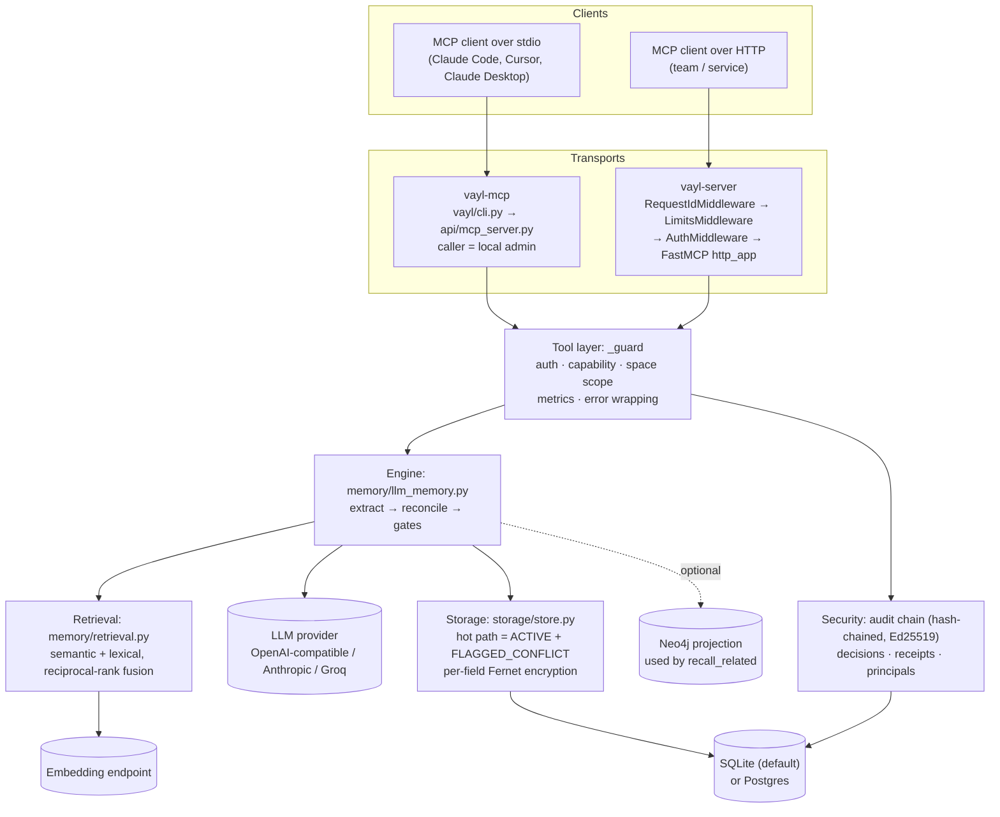
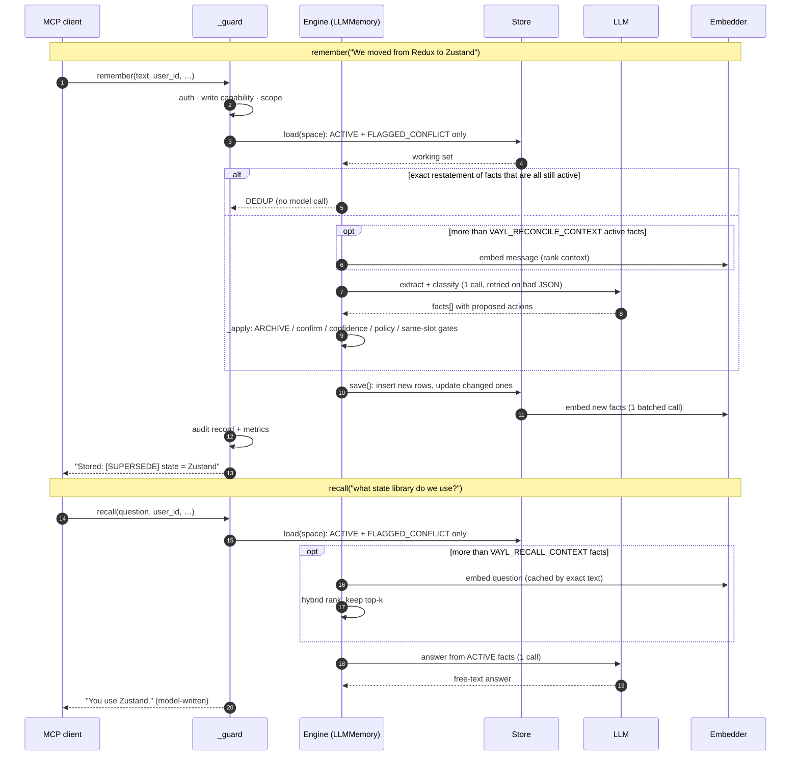

# How Vayl works

Vayl answers "what is true now?" by reconciling each new fact against what it already holds at write time. Reads never have to work out which of several stored values is current. This page follows a request from the transport down to the database and back.

## The problem: memory that goes stale

Additive memory saves every fact and retrieves by similarity. That works until a fact changes. Tell an additive store you moved from Redux to Zustand, then ask what you use, and it can return **Redux**: the old fact is still stored and still matches the query. The model has to guess which remembered value is current, and when it guesses wrong the answer still reads as confident.

Vayl reconciles on write instead. A new value supersedes the old one, a removal retracts it, an ambiguous or unsafe change is flagged for a person, and a past-tense statement is archived as history instead of becoming current. The full model is in [Reconciliation](core-concepts/core-concepts.md).

## Components

### Transports

| Transport | Entry point | Who calls it | Authentication |
| --- | --- | --- | --- |
| `vayl-mcp` (stdio) | `vayl/cli.py` parses `--help`/`--version`, then runs `api/mcp_server.py` | One local MCP client, started by that client | None. The caller runs as a trusted local admin unless `VAYL_AUTH_REQUIRED` is on. |
| `vayl-server` (streamable HTTP) | `vayl/cli.py` → `api/server.py` (`build_app`) | A team or service over the network, at `/mcp` | Required. `Authorization: Bearer vayl_sk_…` or, with a licensed SSO setup, an OIDC ID token. |

`vayl-server` wraps the FastMCP HTTP app in three ASGI layers, outermost first:

1. **`RequestIdMiddleware`** gives every request an ID (it reuses a valid incoming `X-Request-ID`), echoes it on the response, and writes one access-log line per request.
2. **`LimitsMiddleware`** enforces the body-size cap (`VAYL_MAX_BODY`, 1 MiB by default) and a per-IP rate limit (`VAYL_RATE_PER_MIN`, 120 by default). It runs before authentication, so unauthenticated floods are rejected cheaply with `413` or `429`.
3. **`AuthMiddleware`** resolves the bearer token to a principal and binds that principal and its tenant for the whole request. With no valid credential it returns `401`.

`/healthz`, `/readyz` and `/metrics` sit beside the authenticated mount and skip `AuthMiddleware`. `/metrics` can be protected with `VAYL_METRICS_TOKEN`. See [HTTP endpoints](reference/http-endpoints.md).

### The tool layer: `_guard`

All 32 MCP tools route through `_guard(tool, fn, cap=…, space=…)` in `api/mcp_server.py`. The checks are fail-closed and run in this order:

1. **Authenticated?** When authentication is required and no principal is bound, the call is denied.
2. **Capability?** The caller's role must grant the tool's capability (`read`, `write`, `delete`, `verify`, `approve`, `admin`).
3. **In scope?** When the tool touches a `user_id`, a scoped principal must be allowed into that space.

A denial is returned as an `Access denied: …` message and recorded in the audit log. Allowed calls are timed and counted in the metrics store. Exceptions never reach the client: it gets `Vayl couldn't complete that (ref …)`, and the server log holds the detail under the same reference. See [Authentication and access](core-concepts/authentication-and-access.md).

### The engine

`memory/llm_memory.py` holds the write and read logic:

* **Extraction.** One LLM call turns the message into zero or more facts. Each fact has a subject, value, scope, kind (`state` or `event`), `time_ref`, a proposed action and a confidence. If the model returns unparseable JSON, the same request is retried up to `VAYL_EXTRACT_RETRIES` times (default 2). A malformed array still keeps its well-formed facts.
* **Dedup prefilter.** If the exact message (case-folded, whitespace-collapsed) already produced facts that are all still active, the extraction call is skipped and the result is `DEDUP`. Turn this off with `VAYL_DEDUP_PREFILTER=off`.
* **Reconciliation.** `_apply` decides the final action in code. The model's label is only an input. Code applies the valid-time `ARCHIVE` gate for past-tense facts, the confirmation gate for declared `confirm` slots, the confidence threshold (below 0.7 a change is flagged), the source-authority policy, and the same-slot invariant.
* **Answering.** `recall` retrieves the relevant current facts and makes one LLM call to answer from them. The answer is free text written by the model.

The extractor sees at most `VAYL_RECONCILE_CONTEXT` (default 40) of the most relevant active facts. The invariant checks in `_apply` still run against the full active set.

### Retrieval

`memory/retrieval.py` ranks facts for a question:

* **Small spaces skip ranking.** When the pool has `VAYL_RECALL_CONTEXT` (default 40) facts or fewer, every fact goes to the answering model and no query embedding is computed.
* **Larger spaces use hybrid ranking.** Embedding cosine similarity and keyword overlap are ranked separately and combined with reciprocal-rank fusion (constant 60). The top 40 are kept.
* **Graceful degradation.** If the embedder is down or embedding dimensions don't match, lexical ranking carries the query.
* **Critical categories bypass ranking.** Facts whose category is in `VAYL_CRITICAL_CATEGORIES` (or in the call's `critical_categories`) always go into the context. If there are more than `VAYL_CRITICAL_BUDGET` (default 200) of them, the call fails instead of silently truncating.
* **Query embeddings are cached** by exact question text (`VAYL_QUERY_CACHE`, default 512 entries).

### Storage

`storage/store.py` persists each memory space as an event log:

* **Hot path.** `load()` reads only `ACTIVE` and `FLAGGED_CONFLICT` rows, so reconciliation and ordinary recall never touch superseded or historical rows. History is read lazily by `history`, `list_memories`, `export_memory` and `recall(include_history=True)`.
* **Incremental save.** `save()` inserts new rows and updates changed ones in one transaction. Nothing is rewritten.
* **Backends.** SQLite at `VAYL_DB` by default. Postgres when `VAYL_DATABASE_URL` is set (`pip install "vayl-mcp[postgres]"`). The schema is versioned in `storage/migrations.py`: `vayl-migrate status` shows it and `vayl-migrate up` applies pending versions.
* **Encryption at rest** is on by default (`VAYL_ENCRYPT`). Content columns (slot, subject, value, raw text, metadata, source, embedding, graph triple) are Fernet-encrypted per field. A blind HMAC index on the subject keeps equality lookups working. IDs, status, confidence and scope stay in plaintext.
* **Caches.** Decrypted short fields and decoded vectors are cached in process memory. `VAYL_DECRYPT_CACHE=off` disables both, and `VAYL_VECTOR_CACHE` (default 8192) sizes the vector cache. Hard deletes (erasure, retention purge) clear them.
* **Partitioning.** Every row carries `tenant_id`, `user_id`, `agent_id` and `run_id`, and every query filters on all four. See [Memory spaces and tenants](core-concepts/memory-spaces.md).
* **Concurrency.** Writes to the same space are serialized by a space lock: in-process on SQLite, a Postgres advisory lock across processes. Writes to different spaces run in parallel.

### Security layer

* **Audit chain.** Each operation, including denials, is appended to an audit log whose rows are hash-chained (`sha256(prev_hash | row)`). With signing on (`VAYL_SIGN`, default on), each entry is also Ed25519-signed and a signed head checkpoint detects tail truncation. `verify_audit` checks the chain. There is one chain for the whole deployment; each row also records its tenant, outside the hashed content, so listings can be confined to it.
* **Decisions and receipts.** `record_decision` snapshots the exact facts behind an action. `attest` and erasure produce signed receipts that a third party can check with `export_public_key` and `verify_receipt`. Decisions and receipts are stamped with the caller's tenant and only found from inside it.
* **Keys.** The signing seed is derived from `VAYL_KEY` when set, otherwise from an auto-generated `<db>.sign.key` file. Encryption uses a separate key.

### Optional graph projection

With `VAYL_GRAPH=on` and Neo4j configured (`pip install "vayl-mcp[graph]"`), each fact's `(head, relation, tail)` triple is mirrored into Neo4j, and superseded or retracted slots retire their edges. `recall_related` answers relational, multi-hop questions from this graph, falling back to ordinary recall when no graph is attached. The graph is a projection: the triples are also stored in SQLite/Postgres, so it can be rebuilt.

## Data flow: remember and recall

The subject name (`state` above) is chosen by the extraction model unless a [declared slot](core-concepts/core-concepts.md#declared-slots-and-presets) fixes it.

## Model calls per operation

| Operation | LLM calls | Embedding calls |
| --- | --- | --- |
| `remember` | 1 extraction, plus up to `VAYL_EXTRACT_RETRIES` (default 2) retries on unparseable output. 0 when the dedup prefilter matches. | 1 batched call for the new facts on save, plus 1 for the message when the space has more than `VAYL_RECONCILE_CONTEXT` active facts. |
| `forget` | 1 extraction, action forced to `RETRACT` (no dedup prefilter) | 1 batched call for the tombstone rows on save, plus 1 for the message in a large space |
| `recall` | 1 answer | 1 query embedding only when the space exceeds `VAYL_RECALL_CONTEXT` facts, and none on a cache hit |
| `recall_related` (graph on) | 1 answer | 1 query embedding |
| `list_memories`, `history`, `check_before_act`, `pending_changes`, admin and audit tools | 0 | 0 |

Transport errors (429 and 5xx) are retried separately inside the HTTP client.


The trust properties are enforced in code, not in the prompt. Once the extraction model has proposed facts, `_apply` decides deterministically what is stored and what becomes active. A superseded value can't come back as current, because ordinary recall never loads it. Two things still depend on models: extraction (which facts, which subject names) and the embedder that ranks larger spaces. Ranking decides which facts the answering model sees. The recall answer itself is always model-written.


## Where Vayl fits

* **Current truth after change.** Plans, preferences, configs, medications and assignments, answered with the value that holds now.
* **Correct forgetting.** "We dropped X" retires X and keeps a tombstone for audit.
* **Relational questions over your agent's own state**, with the optional graph projection.
* **High-stakes writes.** Confirmation gates, critical-fact categories, and a signed audit trail. See [Safety gates and human approval](guides/safety-gates-and-human-approval.md).
* **Multi-user products.** Isolated memory spaces, tenant partitioning and scoped keys.
* **Local and private.** Encrypted at rest. The only outbound calls go to the LLM and embedder you configure.

## Where Vayl is not the right tool

* **Document or corpus Q&A.** Vayl has no document ingestion. Use RAG for PDFs, wikis and tickets, and Vayl for the state that changes.
* **Corpus-scale knowledge graphs.** The graph projection covers facts your agent has stored, not millions of ingested documents.
* **An append-only log of everything said.** Vayl keeps history but moves it off the hot path. If you need every utterance searchable, pair Vayl with a raw log.
* **Planning and reasoning.** Vayl is a memory layer, not an agent framework.

## Next steps

<table data-view="cards"><thead><tr><th></th><th></th><th data-hidden data-card-target data-type="content-ref"></th></tr></thead><tbody><tr><td><h4><i class="fa-book" style="color:$primary;">:book:</i> Reconciliation</h4></td><td>The nine actions, four statuses, and the same-slot invariant.</td><td><a href="core-concepts/core-concepts.md">core-concepts.md</a></td></tr><tr><td><h4><i class="fa-sitemap" style="color:$primary;">:sitemap:</i> Memory spaces and tenants</h4></td><td>How memory is partitioned per tenant, user, agent and run.</td><td><a href="core-concepts/memory-spaces.md">memory-spaces.md</a></td></tr><tr><td><h4><i class="fa-rocket" style="color:$primary;">:rocket:</i> Quickstart</h4></td><td>Install Vayl and connect a client.</td><td><a href="getting-started/quickstart.md">quickstart.md</a></td></tr></tbody></table>
