# How Vayl works

## The problem: memory that goes stale

Most agent memory is **additive** — it saves every fact it's ever told and retrieves by similarity. That's fine until a fact _changes_. Tell an additive store you moved from Redux to Zustand, ask what you use, and it can hand back **Redux**, because the old fact is still there and still matches the query. The model is left to guess which of several remembered values is true now, and it guesses wrong at exactly the wrong moments — a stale plan, a discontinued medication, a former employee.

The failure is quiet: a confident, well-formed answer that happens to be out of date.

## The approach: reconcile on write

Vayl doesn't just store what it's told — it **reconciles** each new fact against what it already knows, at write time:

* a new value **supersedes** the old one,
* an explicit removal **retracts**,
* an ambiguous conflict is **flagged** for a human instead of guessed,
* independent facts **coexist**, and duplicates are **de-duplicated**.

The result is an invariant Vayl guarantees structurally: **at most one active value per thing** (its `(subject, scope)` — a _slot_). "What's true now" is always a single, unambiguous read, and superseded values move to history rather than disappearing.

## The pipeline

Every write is turned into structured facts by one LLM call, reconciled, and stored. Every read retrieves only the current set and answers from it.

```mermaid
flowchart LR
    A["message:<br/>'we moved to Zustand'"] -->|1 LLM call| B[Extract fact&#40;s&#41;]
    B --> C{Reconcile}
    C -->|new value| D[Supersede]
    C -->|removal| E[Retract]
    C -->|ambiguous| F[Flag]
    D --> G[("SQLite / Postgres<br/>event-sourced")]
    E --> G
    F --> G
    Q["recall&#40;question&#41;"] --> R["Hybrid retrieval<br/>top-k, active only"]
    G -. active set .-> R
    R -->|1 LLM call| T["Answer, or<br/>'I don't know'"]
```

Everything between the two LLM calls is **deterministic local code**. That's what makes Vayl's guarantees structural rather than a matter of prompt wording.

## Why it stays fast and correct

Vayl is event-sourced, but the current picture and the history are kept apart:

* A recall reads only the **active + flagged** set — so a superseded or retracted value **cannot** be returned as current, no matter how the model behaves.
* History lives on disk and is loaded only when you explicitly ask about the past.
* Per-operation cost is therefore **O(active facts)**, not O(everything ever said) — memory can grow indefinitely without slowing recall.

## Where Vayl excels

* **Current truth after change.** The core job: state that changes over time — plans, preferences, configs, medications, assignments — answered with what's true _now_.
* **Correct forgetting.** Removal is first-class: "we dropped X" actually stops X being returned, with a tombstone kept for audit.
* **Multi-hop relational questions.** An optional entity-graph projection answers ownership chains, dependencies, and transitive relations over your agent's own state — measured at 0% silently-wrong on the relational suite, \~50–230 ms even on high-degree hubs.
* **Low cost.** About two LLM calls per fact and a single SQLite file — no graph database required, no heavy pipeline.
* **High-stakes domains.** Critical-fact guarantees, human-approval gates, and a signed, tamper-evident audit trail (see [Safety gates](guides/safety-gates-and-human-approval.md)).
* **Multi-tenant products.** Every user/agent/run is an isolated [memory space](core-concepts/memory-spaces.md); one deployment serves thousands cleanly.
* **Local and private.** Encrypted at rest; the only outbound call is the LLM/embedder you choose.

## Where Vayl is _not_ the right tool

Being honest about the edges saves you an evaluation:

* **Document or corpus Q\&A.** When the answer lives in PDFs, wikis, or tickets, that's retrieval over a corpus (RAG) — a different job. Vayl has no document ingestion; it's the **complement**, not the replacement. The common setup runs both: RAG for the corpus, Vayl for the state that changes.
* **Corpus-scale knowledge graphs.** Vayl _does_ answer multi-hop relational questions over your agent's own state (see above). What it isn't is a knowledge graph over millions of ingested documents — for that scale, a dedicated graph database is the right core. Relational queries on the state you track: yes. A corpus-scale graph: no.
* **An append-only log of everything ever said.** Vayl deliberately retires superseded values off the hot path so recall stays current and fast. If you specifically want to keep every past utterance searchable for later mining, pair Vayl with a raw log — the two answer different questions.
* **Planning and reasoning.** Vayl is a memory layer, not an agent framework — it gives your agent's LLM a reliable, current memory to reason _over_, and leaves the reasoning to the model.

## Next

* [Getting started](getting-started/getting-started.md) — install and connect it.
* [Core concepts](core-concepts/core-concepts.md) — the reconciliation model in detail.
