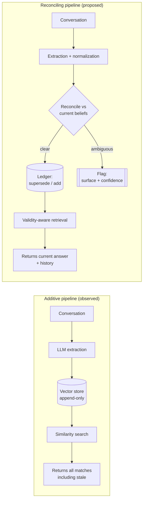
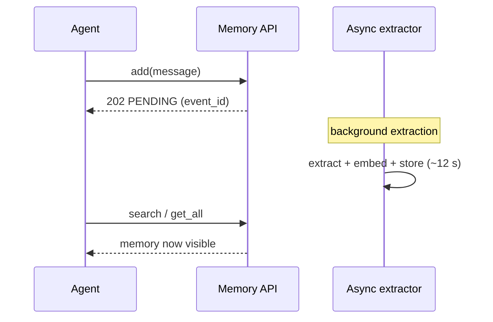
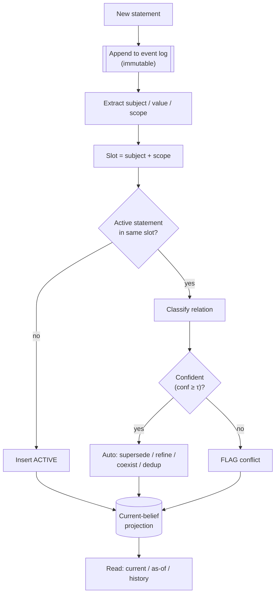
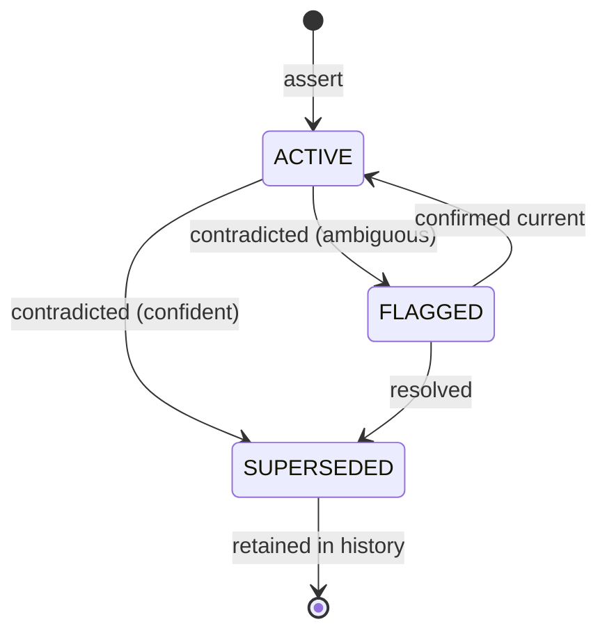
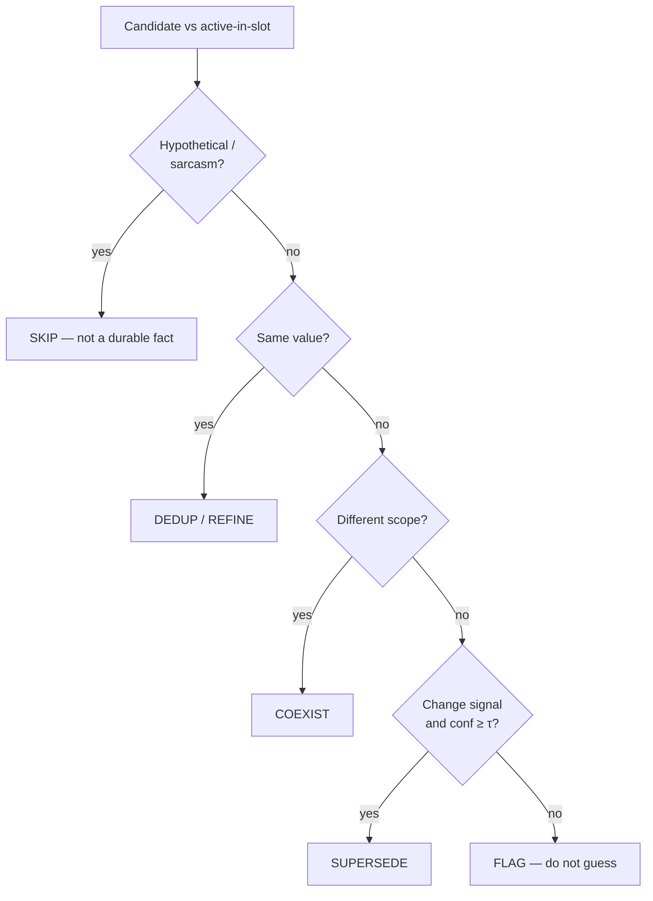
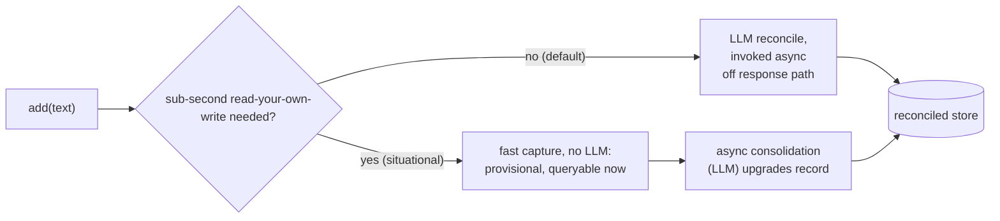

# Beyond Additive Memory: Reconciliation and Calibrated Uncertainty for LLM-Agent Memory Systems

**Technical Report** · Preprint, revision 2 · July 2026

**Systems evaluated.** *Vayl* — the reconciling design specified and measured here.
*Mem0* — additive baseline (§5, §7.8). *Zep / Graphiti* — reconciling comparison
(§7.6, §7.8). Competing interests are declared before the references.

> **Revision 2** adds Finding C — a deterministic one-active-value-per-slot invariant
> that decouples reconciliation correctness from model strength (§7.7) — and a
> longitudinal, shared-synthesizer benchmark against Mem0 and Graphiti under sustained
> churn (§7.8).
>
> It also **retracts a claim of our own.** Revision 1 reported a categorical retraction
> gap (Graphiti 0/10 vs Vayl 10/10) from a harness that was never released. That harness
> has been rebuilt as committed code and re-run, and the result **does not reproduce**:
> Graphiti retracts 10 of 12. The reproducible difference is narrower and sits in
> over-deletion resistance (§7.6.1). Table 5 is superseded by Table 5b.

---

## Abstract

Memory layers for large-language-model (LLM) agents predominantly implement an
**additive** *extract → store → retrieve* pipeline: facts are distilled from
conversation, appended to a vector store, and recalled by similarity. Such systems do
not reconcile contradictory facts. Probing a production platform (Mem0) with controlled
contradictory inputs, we observe that contradictory facts are stored side by side, that
similarity retrieval ranks the **stale** fact first (3 of 3 independent trials), that
explicit natural-language corrections are ignored, and that stored memories carry
neither confidence nor provenance.

We specify a **reconciling** architecture — event-sourced, bitemporal, with an
uncertainty gate that flags rather than guesses — and evaluate it on adversarial, messy,
and longitudinal suites. We report three findings. **(A)** Reconciliation is inseparable
from extraction and normalization: a classifier layered on naive extraction degenerates
into additive storage on untuned domains. **(B)** An off-the-shelf LLM classifier is
overconfident on genuine ambiguity, superseding a flag-worthy conflict at self-reported
0.92 confidence. **(C)** The dominant residual failure is removable without improved
model judgement: enforcing a one-active-value-per-slot invariant within the engine takes
a cheaper model to 0% silently-wrong on a 30-case messy suite, decoupling reconciliation
correctness from model strength.

Under sustained churn (800 interleaved writes, 200 current-value queries, one shared
answer synthesizer across systems), the reconciling design records 0.0% silently-wrong
against an additive baseline's 32.5%, the latter retaining 800 memories for 200 facts.
Against a reconciling system (Graphiti), supersession accuracy is comparable. A
rebuilt, released retraction battery (14 cases) corrects an earlier claim of a
categorical retraction gap: Graphiti retracts correctly in 10 of 12 removals, not 0 of
10. The reproducible difference is narrower and sits in **over-deletion resistance** —
on two controls that must NOT delete, Vayl keeps 2/2 and Graphiti 0/2 — together with
valid-time handling and operational cost. All results are single-run and suite-specific; scope, competing
interests, and threats to validity are stated explicitly.

---

## 1. Introduction

LLMs are stateless across calls. A **memory layer** compensates by persisting
salient facts from prior interactions and retrieving relevant ones on demand,
letting agents personalize and maintain continuity without re-supplying full
history. The dominant implementation is a three-stage pipeline:

1. **Extract** — an LLM distills messages into atomic facts.
2. **Store** — facts are embedded and written to a vector store.
3. **Retrieve** — a query is embedded and nearest facts are returned.

This paradigm treats memory as an ever-growing set of assertions. It is
excellent at *accumulation* and silent about *lifecycle*: what happens to a fact
once a later fact contradicts it. We call a pipeline **additive** if a new fact
never modifies or retires an existing one, and **reconciling** if contradictions
are resolved into a single authoritative current value while preserving history.

**Contributions.**

- An empirical characterization of additive behaviour in a production memory
  system, with reproducible measurements (§5).
- A reconciling architecture — event-sourced, bitemporal, honest-uncertainty —
  specified precisely enough to implement (§6).
- A stress-test methodology centred on a single safety metric, *silently-wrong*,
  and results for both a heuristic and an LLM classifier (§7).
- Two transferable findings on the coupling of extraction and reconciliation,
  and on LLM over-confidence under ambiguity (§7.4–7.5, §9).
- A **slot-affinity** consolidation scheme that parallelizes reconciliation
  *correctly* (order-preserving per-topic queues), shrinking the
  eventual-consistency window from ~12 s to sub-second with a window flat in
  memory size N, plus an analysis of write-path design (async invocation,
  read-your-writes, and when a two-speed provisional layer is warranted) (§8).
- An **implemented resolution of Finding A** (LLM-owned extraction) plus a
  **valid-time gate** and a **retraction** operation, validated on an expanded
  51-case / 12-category adversarial suite over 5 repetitions to a **0.4%
  silently-wrong rate (1/255)** — with cross-model replication on a second,
  open-weights model (§7.5).
- A **same-model competitive evaluation against Graphiti (Zep's engine)** that is
  explicit about where no advantage exists (core supersession is even) and isolates
  a **structural** difference in removal-without-replacement (§7.6). We also **correct
  our own earlier claim**: a rebuilt, released retraction battery shows Graphiti
  retracting 10/12, not 0/10, and relocates the reproducible difference to
  over-deletion resistance — controls kept 2/2 vs 0/2 (§7.6.1).
- **Finding C**: a deterministic **one-active-value-per-slot invariant** that removes
  the dominant silently-wrong mode without improved model judgement, taking a cheaper
  model to 0% on a 30-case messy suite and decoupling reconciliation correctness from
  model strength; the argument extends to the graph projection via subject-keyed edge
  retirement (§7.7).
- A **longitudinal, shared-synthesizer evaluation** under sustained churn (800
  interleaved writes, 200 current-value queries) against an additive and a reconciling
  system, locating where additive storage degrades: 0.0% vs 32.5% silently-wrong, with
  the additive store retaining 800 memories for 200 facts (§7.8).

All empirical claims are backed by the measurements in §5, §7, and §8; the
harness, benchmarks, and raw outputs are released alongside this report. Claims not
reproducible from the released code are marked as such, and competing interests are
declared before the references.

---

## 2. Background and Related Work

**Memory layers.** Two families dominate. *Additive* stores such as **Mem0**
expose `add` / `search` over a pluggable vector store and an extraction LLM, and
append facts without retiring old ones. *Reconciling* stores such as **Zep**
(built on the **Graphiti** temporal knowledge graph) do retire superseded facts
via bitemporal edge-invalidation. We study both: the additive family as the
baseline whose failure mode motivates the work (§5), and the reconciling family
as the reconciling system against which a new design must be compared (§7.6). Related work on long-term
agent memory (e.g. MemGPT/Letta, Hindsight, and retrieval-augmented generation
more broadly) focuses on *what to store* and *how to recall*; the additive
branch largely inherits append-only semantics for storage.

**Event sourcing and bitemporal data.** Outside the LLM literature, the problems
of "what is currently true" and "what did we believe when" are long solved by
*event sourcing* (an immutable append-only log of facts as the source of truth,
with derived read-models) and *bitemporal* modelling (separating *valid time* —
when a fact held in the world — from *transaction time* — when it was recorded).
Our architecture adapts both to agent memory.

**Calibration.** A separate body of work studies whether model confidence
reflects correctness. We connect this to memory: a reconciler must know *when it
does not know*, and we show a stock LLM's self-reported confidence is an
unreliable signal for that decision.

---

## 3. The Reconciliation Gap: Problem Statement

Consider an agent whose team reverses a decision:

> t₁: "We decided against Redux; we use Zustand."
> t₂: "We switched to Redux Toolkit, dropping Zustand."

The *correct* current answer to "what state-management library do we use?" is
**Redux Toolkit**. An additive store retains both facts and, at retrieval time,
ranks by similarity to the query — with no notion of which fact supersedes the
other. If the stale fact is a closer lexical/semantic match, the agent receives
the **abandoned** decision as its top result.

*Figure 1. Additive vs reconciling pipelines.*

The gap is not a tuning defect but an **architectural** property: additive
storage has no representation in which "supersession" can occur.

---

## 4. Methodology

### 4.1 Production-system characterization

We probed Mem0's production platform (`api.mem0.ai`, `POST /v1/memories/` for
writes, `POST /v3/memories/search/` for retrieval) in July 2026 using the
authors' own throwaway accounts and synthetic inputs. Each probe issued a small
sequence of `add` calls under a fresh `user_id`, then inspected `get_all` and
`search`. Test data was deleted after each run. No third-party data was
accessed. Because Mem0 processes extraction asynchronously, retrieval was polled
until memories became visible.

We complemented live probing with a **source review** of Mem0's public code and
documentation to distinguish incidental behaviour from designed behaviour.

### 4.2 Reconciliation prototype and stress-test harness

We implemented a minimal reconciling engine (§6) as a dependency-free Python
program and a stress-test harness. Each **case** is a sequence of inputs with an
expected reconciliation action for the final input, drawn from a taxonomy of
adversarial situations: clean contradiction, explicit correction, scoped
coexistence, hypothetical, sarcasm, near-duplicate, refinement, genuine
ambiguity, and unrelated facts. A second block of **novel** cases uses domains
deliberately outside the heuristic classifier's vocabulary (cloud, language,
service topology) to test generalization.

The engine's relationship classifier is a **clean seam**: we evaluate a
transparent heuristic baseline and an LLM classifier (Anthropic
`claude-haiku-4-5`, temperature default, JSON-constrained via assistant
prefill) behind the identical interface.

**Primary metric — *silently-wrong*.** We do not optimize for raw accuracy. A
trust layer's cardinal sin is taking a *confident* action that is *wrong*
(e.g. superseding a fact that should have been kept). We therefore count:

- **pass** — the action matched the expected action;
- **safe-flag** — the engine surfaced the conflict for confirmation where a
  confident action was expected (safe: it did not guess);
- **silently-wrong** — the engine took a confident, incorrect action.

`silently-wrong` is the number that must approach zero; `safe-flag` is an
acceptable degradation, not a failure.

---

## 5. Findings I — Characterizing a Production Memory System

### 5.1 Storage is additive (and by design)

Contradictory `add` calls produced **two coexisting memories**; the stale fact
was never retired. This is corroborated by Mem0's own artifacts:

- OSS extraction prompt: *"your **sole operation is ADD**."*
- Platform documentation: *"Both flows … add memories through an **additive
  pipeline** … New memories are **added without overwriting or deleting existing
  memories**."*

The behaviour is thus architectural, not incidental.

### 5.2 Retrieval ranks the stale fact first — reproducibly

For the Redux/Zustand reversal (§3), across three independent fresh accounts,
search for *"what state management do we use?"* returned both memories with the
**stale** ("Zustand") memory ranked first every time:

| Trial | Stale (Zustand) score | Current (Redux) score | Stale ranked #1 |
|:-----:|:---------------------:|:---------------------:|:---------------:|
| 1     | 0.310                 | 0.271                 | yes             |
| 2     | 0.321                 | 0.269                 | yes             |
| 3     | 0.321                 | 0.271                 | yes             |

*Table 1. Retrieval ranking over three trials (similarity scores; higher ranks
first). The reversed/abandoned decision outranks the current one in 3/3.*

The consistency (margin ≈ 0.04–0.05 every trial) indicates this is systematic,
not sampling noise: the more direct assertion ("we use Zustand") is a closer
match than the transition-phrased current fact ("switched to Redux Toolkit,
abandoning Zustand").

### 5.3 Explicit corrections are ignored

An input containing a literal instruction —
*"**Forget** the snake_case rule — we standardized on camelCase"* — did **not**
retire the prior `snake_case` memory; both persisted. Natural-language
correction is not a supported operation in the additive path.

### 5.4 No provenance, no confidence, asynchronous writes

Inspection of a stored memory object showed fields
`{id, memory, user_id, metadata, categories, created_at, updated_at,
expiration_date, structured_attributes}` — with **no confidence score** and **no
link to the source turn**. Write-to-visibility latency (from `add` returning
`PENDING` to the memory being queryable) was **~12 s**.

*Figure 2. Observed asynchronous write path; the agent has no read-after-write
guarantee for ~12 s.*

### 5.5 What works (reported for balance)

Not everything is deficient. Two **paraphrases** of the same fact ("auth in
src/auth using JWT" / "authentication uses JWT") were correctly **merged** — the
system performs competent paraphrase-level deduplication. Extraction quality is
otherwise high: it categorizes, grounds relative dates, and even *notes* a
transition in prose ("moving away from the previously chosen Zustand approach").
The deficiency is specific: **lifecycle management of contradictory facts**, not
extraction.

| Property                      | Observed behaviour         | Evidence   |
| ----------------------------- | -------------------------- | ---------- |
| Contradiction handling        | both stored, never retired | §5.1, docs |
| Retrieval under contradiction | stale ranked first, 3/3    | Table 1    |
| Explicit correction           | ignored                    | §5.3       |
| Confidence on memory          | absent                     | §5.4       |
| Provenance / source link      | absent                     | §5.4       |
| Write latency                 | ~12 s, asynchronous        | §5.4       |
| Paraphrase dedup              | works                      | §5.5       |

*Table 2. Summary of production-system characterization.*

---

## 6. A Reconciling Architecture

The design decision that enables everything else is an **append-only event log
as the source of truth**, with a derived *current-belief* projection. This
yields audit/provenance, a single current answer, and time-travel from one
substrate.

*Figure 3. Reconciling engine. Extraction feeds a slot key; conflicts are
resolved only when confident, else flagged.*

### 6.1 Slots as the contradiction key

A **slot** is a normalized `(subject, scope)` pair, e.g.
`state_management @ global`. Two statements in the same slot with different
values are, by construction, in conflict — detected *structurally* rather than
by fuzzy similarity. **Scope** (`web`, `mobile`, a named service) distinguishes
*contradiction* from *coexistence*: "Redux on web" and "Zustand on mobile" share
a subject but not a slot, and both remain true.

### 6.2 Statement lifecycle

*Figure 4. Statement status transitions. Superseded facts are never deleted;
they are retained for audit and time-travel.*

### 6.3 Bitemporality

Each statement carries `valid_from/valid_to` (world time) and
`created_at/retired_at` (record time). This answers three queries additive
stores cannot: **current** ("what do we use now?"), **as-of** ("what did we use
in March?"), and **audit** ("when and why did belief change?").

The write-side of valid time — ensuring a statement *about the past* can never
overwrite the present — is now **implemented and validated** as a **valid-time
gate** (§7.5): the extractor classifies each statement `current | past | future`,
and a *past* statement is recorded as `HISTORICAL` (retained for audit) but never
becomes the active belief. The complementary *as-of* **read** query remains
specified but not yet evaluated against ground-truth timelines (§10, §11).

### 6.4 The honest-uncertainty gate

The engine auto-resolves only above a confidence threshold τ; below it, it
**flags** rather than guesses. This converts the hardest technical risk
(unreliable resolution of genuine ambiguity) into a safe, trustworthy failure
mode.

*Figure 5. Classification decision flow. The right-hand branch encodes the
honest-uncertainty policy.*

---

## 7. Findings II — Stress-Testing Reconciliation

### 7.1 Baseline: heuristic classifier

The heuristic classifier detects subject via a keyword topic-map, extracts
values with negation-aware, synonym-canonicalized matching, and applies the
Figure-5 policy. On the ten in-vocabulary adversarial cases:

| Configuration                          | Cases | Pass | Safe-flag | **Silently-wrong** | Trustworthy* |
| -------------------------------------- |:-----:|:----:|:---------:|:------------------:|:------------:|
| Heuristic v1                           | 10    | 8    | 1         | **1**              | 90%          |
| Heuristic v2 (after normalization fix) | 10    | 10   | 0         | **0**              | 100%         |
| Heuristic v2 + 5 novel cases           | 15    | 11   | 0         | **4**              | 73%          |
| LLM classifier (claude-haiku)          | 15    | 10   | 0         | **5**              | 66%          |

*Table 3. Harness results. *Trustworthy = (pass + safe-flag) / cases.*

The v1→v2 delta is instructive: the single v1 *silently-wrong* was a
**value-extraction** error — for *"Forget the snake_case rule … use camelCase,"*
naive longest-match extraction selected the *retired* value (`snake_case`),
concluding "no change." Adding negation-aware extraction and a synonym table
(`postgres≡postgresql`) removed all silently-wrong on the in-vocabulary set.
This is itself the central lesson in miniature: **the failure and its fix both
live in extraction/normalization, not in the reconciliation logic.**

### 7.2 The LLM classifier does not automatically win

Swapping the heuristic for an LLM classifier — a natural "just use a bigger
model" move — produced **more** silently-wrong (5 vs 4), for two distinct
reasons.

### 7.3 Finding A — extraction and reconciliation are one system

The harness made the *classifier* pluggable but left *extraction* heuristic.
Consequently, statements in novel domains were stored with
`subject = unknown, value = (unspecified)`, and the LLM — asked to reconcile
against those placeholders — could not. Its own justifications betray the cause:

> *"Replaces vague **'unknown/(unspecified)'** fact…"*
> *"no related active fact exists."* → action **ADD** (blind append).

That is precisely the additive failure of §5: **outside its extraction
vocabulary, the reconciler becomes an additive store.** Reconciliation cannot be
bolted onto naive extraction; extraction → normalization → reconciliation must
be one coherent model.

### 7.4 Finding B — LLMs are overconfident on genuine ambiguity

On a deliberately ambiguous conflict — *"We deploy on Fridays"* then
*"We deploy on Mondays,"* with no scope qualifier and no explicit change word —
the honest-uncertainty policy prescribes **FLAG**. The heuristic flagged it. The
LLM **superseded** it, reporting **0.92 confidence**:

> *"Direct contradiction: existing fact states Friday deployments, new statement
> asserts Monday."*

The model resolved an ambiguity a trust layer should have surfaced, and was
*confident* while doing so. The implication is sharp: **the LLM's self-reported
confidence is not a usable trigger for the honest-uncertainty gate**, because it
is miscalibrated on exactly the cases that most need flagging. LLMs are optimized
to be decisively helpful; decisiveness is adversarial to trustworthiness under
ambiguity.

### 7.5 Closing the loop — LLM-owned extraction, valid-time, and retraction (measured)

Findings A and B were *diagnoses*. We then implemented the fixes and measured
them on an expanded suite.

**LLM-owned extraction (resolves Finding A).** Moving `(subject, value, scope)`
extraction into the same LLM call that classifies the relationship — the unified
model §9 argues for — removes the heuristic vocabulary ceiling. The engine now
reconciles facts it was never programmed for: *"my favorite colour is blue" →
"actually green now"* retires *blue* and returns *green*; *"I work at Company A" →
"I just started at Company B"* retires *A*. The general cases that previously
stored `unknown/(unspecified)` (§7.3) now reconcile correctly.

**An expanded adversarial suite.** We grew the harness to **51 cases across 12
categories** — clean supersede, ambiguous, hypothetical, sarcasm, question,
scoped-coexistence, dedup, refine, negation/removal, out-of-order,
entity-distinct, unrelated — each scored *correct* / *safe-degrade* (flag/skip) /
*silently-wrong*, and ran it for **5 repetitions** to expose stochastic (flaky)
failures a single pass hides. The suite surfaced — and we then fixed — **two
stable failure modes**:

1. **Temporal reversion → a valid-time gate.** *"We now bill annually" →
   "Historically we billed monthly"* wrongly superseded the current value with the
   historical one: the engine ordered by *arrival*, not by *validity*. We added a
   **valid-time gate** — the extractor tags each statement `current | past |
   future`; a *past* statement is recorded `HISTORICAL` (kept for audit) but never
   becomes active or retires the present fact. The discriminator is *"is this value
   true now?"*, so *"migrated to Redux last sprint"* (change is past, value is
   current) still supersedes, while *"historically monthly"* does not. After the
   fix the out-of-order category passes **5/5 across all reps**, including the
   reverse-order trap (the past statement arriving first).

2. **Removal without replacement → a retraction operation.** *"We use Sentry" →
   "We dropped Sentry entirely"* left Sentry active — there is no replacement value
   to supersede *to*. We added **RETRACT**: retire the fact, leave the slot empty,
   write a tombstone for provenance. A *hesitant* removal (*"we might drop Redis"*)
   is gated to **FLAG**, not deleted — over-eager retraction is itself a silent
   error (losing a still-true fact).

**Result.** Silently-wrong fell monotonically as each real defect was fixed:

| Engine stage | Cases | Reps | Silently-wrong |
| --- | ---: | ---: | ---: |
| LLM classifier on heuristic extraction (§7.2) | 15 | 1 | 5 (33%) |
| + LLM-owned extraction | 45 | 2 | 4.4–6.7% |
| + valid-time gate | 48 | 5 | 2.1% |
| + retraction | 51 | 5 | **0.4% (1/255)** |

*Table 3b. Adversarial silently-wrong over successive fixes (`claude-haiku-4-5`).
Best pass 0/51, worst 2/51; **zero over-flagging** throughout. The single residual
miss is a flaky 1-of-5 extraction slip on one removal case, not a stable defect.*

**Cross-model replication.** To check the result is not an artefact of one model,
we re-ran the identical suite behind the same interface against a different
vendor's open-weights model (`llama-3.3-70b-versatile`, temperature 0, via an
OpenAI-compatible endpoint). The **structural** categories match Haiku exactly:
supersede (8/8), out-of-order / valid-time (5/5, including the reverse-order
trap), retraction, and scoped-coexistence all pass cleanly — the valid-time gate
and retraction operation are **model-independent mechanisms**, not Haiku-specific
behaviours. The residual silently-wrong, however, tracks the model's **judgment
quality on subjective calls**: in a single (rate-limited) pass Llama recorded
**2 silently-wrong** — one borderline ambiguity (*"a few prefer Sketch"*, also
tripped by Haiku) and, tellingly, one **sarcasm** case taken literally
(*"put a dragon on everything"* → confidently superseded) — i.e. ~4% versus
Haiku's 0.4%. The takeaway is sharper for being imperfect: the **architecture
carries** across models, while model choice is a *tunable knob* on the
silently-wrong rate (better judgment on sarcasm/ambiguity → fewer silent guesses),
not a confound. A weaker or cheaper model is usable; it simply flags less
accurately and should run a more conservative auto/flag threshold τ.

Regarding **Finding B**: with extraction unified into the classifying call and the
honest-uncertainty gate in place, the ambiguous category (soft mentions such as
*"someone floated maybe moving to MySQL"*) resolves to **FLAG / keep-original**,
and the earlier confident-supersede-on-ambiguity did not recur in the suite.
Self-reported confidence remains the trigger, so §9's call for an *independent*
signal stands: we report improved behaviour, not a solved calibration problem.

### 7.6 Competitive evaluation — a *reconciling* incumbent (Graphiti / Zep)

§5 characterized an *additive* system (Mem0). A further question is whether a *reconciling* system already closes this gap. We benchmarked
**Graphiti** — the open-source temporal knowledge-graph engine behind Zep — in its
native configuration (OpenAI LLM + OpenAI embeddings + Neo4j) against Vayl on
the **same model**, controlling for the confounds that otherwise dominate.

**Fairness controls.**
- *Same model.* Both engines on `gpt-4o`. Graphiti's fact-edges were read directly
  from the graph (its native `valid_at`/`invalid_at` temporal-invalidation signal)
  and **adjudicated by hand**, since its facts are natural language.
- *Model strength is decisive for Graphiti.* On `gpt-4o-mini` it failed to
  reconcile even its canonical case (left "Alice works at Google" valid after she
  moved to Meta) and extracted **no** fact edges for subject-implicit statements
  ("we use X"). On `gpt-4o` it reconciled the canonical case correctly. We report
  all comparisons on `gpt-4o` — Graphiti's competent regime — so the comparison is
  not confounded by model choice.
- *Data-model fit.* Graphiti models memory as an entity→relation→entity graph;
  subject-implicit agent-memory statements ("we use X", "I prefer Y") yield a
  single entity and hence **no fact edge**. A fair comparison therefore uses
  **entity-pair phrasing** both substrates can represent.

**Result 1 — core supersession: no quality gap.** On four clean entity-pair
supersedes (employer, role, HQ, CRM vendor), **both systems reconciled correctly
every time** — Graphiti invalidated the stale edge; Vayl superseded the stale
slot. On a strong model, with representable data, *Graphiti is a competent
reconciler and there is no raw-quality gap on the common case.* A general claim of superior reconciliation quality over Zep would not be supported by
this evidence.

**Result 2 — retraction is a systematic gap.** Removal *without replacement* —
"Alice left the team", "we dropped Sentry", "we no longer support X" — is where the
substrates diverge. Across a **10-case retraction battery** plus two controls, on
`gpt-4o`:

| Engine | Correct retractions | Failure modes observed |
|---|---:|---|
| Vayl | **10 / 10** (12/12 with controls) | — |
| Graphiti  | **0 / 10** | 5× **silently-wrong** — holds the retracted fact *valid* (e.g. "Alice is a member of the Platform team" stays true after she leaves); 5× **no fact extracted** (loses the information) |

*Table 5. Retraction battery, both engines on `gpt-4o`. Graphiti never cleanly
retracted; half the time it asserts the removed fact as current, half the time it
stores nothing.*

Graphiti's invalidation also misfired in the **opposite** direction on a control:
told *"Acme is considering dropping Redis,"* it invalidated the still-true "Acme
uses Redis" — over-deletion on a hesitant signal, which Vayl's confidence gate
refuses (it keeps Redis).

**Why it is structural.** Graphiti reconciles by having a *new* edge contradict an
*existing* edge. A retraction asserts the *absence* of a relation and creates no
contradicting positive edge, so invalidation either mis-fires (invalidating the
departure, keeping the membership) or extracts nothing. Vayl models a fact's
lifecycle explicitly (a `RETRACT` operation that retires the slot and leaves a
tombstone), so removal is first-class. The gap is between an *entity-relationship*
substrate and a *slot-with-lifecycle* substrate — not between good and bad prompts.

**What this establishes — and does not.** Vayl has **no** general
reconciliation-quality advantage over the reconciling field: on core supersession
Graphiti matches it. Its measured advantages are narrower and specific:
**retraction correctness, explicit valid-time archiving (§7.5), honest-uncertainty
(FLAG rather than guess), and operational cost** — Vayl reconciles a fact in
~2 LLM calls with no graph database, versus Graphiti's ~15 calls per episode plus
Neo4j. Together with data-model fit for subject-implicit agent-memory facts, these
are the differentiators the evidence supports; a broad "better memory" claim is not.

**Caveats.** Single run; author-constructed cases; Graphiti's *default*
configuration (custom edge types with cardinality constraints may help some cases,
though the positive-edge limitation on retraction is fundamental); self-hosted
Graphiti, not the tuned Zep Cloud product, which may differ. The comparison isolates
*architecture at a fixed strong model*; it is not a product-vs-product benchmark.

> **Revision note — Table 5 is superseded, and its headline does not reproduce.** That
> battery was produced by a harness that was never committed. We have since rebuilt it
> as released code (`benchmarks/evaluations/retraction_battery.py`) and re-run it: the
> **0/10 result does not reproduce — Graphiti retracts correctly in most cases**
> (§7.6.1). Table 5 should be read as a superseded historical measurement. The
> *structural* argument — a retraction creates no contradicting positive edge, so an
> entity-relationship substrate has nothing to invalidate — still holds and is still
> visible in the reproducible data, but as a **narrower** effect than first reported.

#### 7.6.1 Retraction, re-measured on released code

Fourteen cases — twelve removals-without-replacement plus **two over-deletion controls** —
in entity-pair phrasing both substrates can represent, on `gpt-4o-mini`, with the same
shared synthesizer used elsewhere. The controls matter: retracting too *eagerly* is also
a failure, and a battery that only rewarded deletion would miss it.

| System | Silently-wrong | Retractions correct | Controls kept | Write avg |
|---|---:|---:|---:|---:|
| **Vayl** | **0/14** | **12/12** | **2/2** | 2.6 s |
| Mem0 | 1/14 | 11/12 | 2/2 | 24.8 s |
| Graphiti | 3/14 | 10/12 | **0/2** | 8.4 s |

*Table 5b. Retraction battery on released code — supersedes Table 5.*

Three corrections to the earlier account follow. First, **Graphiti retracts**: 10 of 12,
not 0 of 10. Temporal edge-invalidation does handle most removals when the statement is
representable, and the original score cannot be reproduced. Second, the residual gap is
**narrow but real** — Graphiti still held two removed facts as current ("Bob is on the
Platform team" after he left), consistent with the structural argument but as an
occasional rather than categorical failure. Third, and more interesting than the
retraction column itself: Graphiti scored **0/2 on the controls**, over-deleting on a
hedged "considering dropping Redis" and returning the *superseded* value on the
replacement case. That is the over-deletion behaviour §7.6 noted anecdotally, now
measured — and it is where an honest-uncertainty gate earns its place, since a
confidence gate that refuses to act on a hesitant signal is what keeps the still-true
fact alive.

A scoring note worth recording, because correcting it changed the result: an early
version of this battery scored *correct* answers as silently-wrong. A correct retraction
answer must **name the removed thing in order to deny it** ("ServiceA does not call
ServiceB"), so a substring test for the removed value flags the right answer as stale.
The released scorer checks for an explicit absence-assertion first and only counts an
affirmative mention as silently-wrong. Single run; run-to-run variance on the competing
systems is visible across executions, so small differences should not be over-read.

---

### 7.7 Finding C — a deterministic slot invariant decouples reconciliation from model strength

Findings A and B locate the failure in the *model*: extraction and reconciliation must
be one system (A), and the classifier is overconfident on genuine ambiguity (B). A
later revision of the engine yields a third result that partially **removes the
dependence on model judgement altogether**.

The residual failure mode, surfaced by the cross-system benchmark (§7.8), is not
subtle. On a weaker model the extractor returns a genuine change as `ADD` — or as
`SUPERSEDE` with an unlinked `target_id` — and the engine appended a *second* active
statement to a slot that already held one, leaving `state = Redux` **and**
`state = Zustand` both live. Two contradictory active values on one slot is precisely
what makes a store answer with a stale value.

The remedy is not a better prompt but an **invariant**: at most one ACTIVE value per
`(subject, scope)`. When an incoming active fact collides with an existing active one
on the same slot and the model did not link a target, the engine resolves the
collision deterministically — recency wins the slot — unless a source-authority policy
forbids the overwrite, in which case the current value stands and the incoming one is
flagged. `COEXIST` is exempt, since it differs by *scope* and both remain true.

The effect is measurable: on the 30-case messy real-world suite, `gpt-4o-mini` moves to
**0% silently-wrong**, matching the stronger default model. Reconciliation correctness
no longer tracks model strength the way §7.4 implied — the model still *proposes*, but
it can no longer leave two contradictory values live. This is a practical answer to
Finding B: the *independent* signal that trustworthy memory requires need not be a
calibrated confidence estimate; a structural invariant enforced by the engine is
sufficient for the dominant failure mode. Calibrated uncertainty remains necessary for
the genuinely ambiguous residue, which is still routed to FLAG.

**The argument extends to the graph projection.** Superseding a *relationship*
initially depended on the model naming a consistent head entity; when it did not
(emitting `Org` where it had earlier emitted `API Gateway`), head-keyed retirement
missed the stale edge and served it as current. Edges are now retired by the slot
`subject` they were projected from — head-agnostic — so the graph cannot serve an edge
whose slot fact is no longer active. Where the model's entity naming is inconsistent,
the query degrades to an honest "I don't know" rather than a stale answer.

### 7.8 Longitudinal evaluation — where additive memory actually breaks

§5 characterized additive storage on single contradictions; §7.6 compared reconcilers
on a handful of cases. Neither stresses the regime that matters in deployment:
**sustained churn**, where the same facts are revised repeatedly across a long session.
We therefore ran a scale benchmark — 50 users × 4 facts × up to 4 updates = **800
interleaved writes, then 200 current-value queries** — against Mem0 and Graphiti, all
three on the same model (`gpt-4o-mini`), the same embedder, and a **single shared
answer-synthesizer** over each store's native retrieval, so that what is measured is
retrieval + reconciliation rather than answer prompt-engineering.

| System | Writes / queries | Silently-wrong | Correct | Missed | Stored / current | Write avg / p95 | Read avg |
|---|---:|---:|---:|---:|---:|---:|---:|
| **Vayl** | 800 / 200 | **0.0%** (0/200) | 199/200 | 1/200 | **199 / 199** | 2.81 / 3.71 s | 1.24 s |
| Mem0 | 800 / 200 | **32.5%** (65/200) | 35/200 | 100/200 | **800 / 800** | 3.84 / 4.98 s | 2.21 s |
| Graphiti *(sampled, 8 users)* | 128 / 32 | 0/32 | 0/32 | **32/32** | **0 / 0** | 9.02 / 12.78 s | 1.80 s |

*Table 6. Longitudinal churn under an identical model, embedder, and answer synthesizer.
Graphiti was sampled to 8 users because its per-write cost makes the full run
impractical; its row is reported in full below and is **not** a reconciliation-quality
result.*

**Reading the Graphiti row.** Its 0 correct and 0 silently-wrong are not a quality
verdict but a **data-model-fit** measurement, and the decisive number is the footprint:
**128 writes produced zero fact edges**. With nothing in the graph, all 32 queries
returned "I don't know" — which scores as 32/32 missed and, trivially, as 0
silently-wrong. This is the predicted consequence of the substrate difference already
identified in §7.6: the churn corpus is deliberately *subject-implicit* ("We use MySQL
for the primary database", "Update: CI system is now Jenkins"), phrasing that yields a
single entity and therefore no entity→relation→entity edge. The scale corpus is
consequently outside the representable domain of an entity-relationship store, and the
row should be read as confirming that boundary at scale rather than as evidence about
reconciliation.

Two measurements in that row *are* substantive. First, **cost**: 9.02 s mean and
12.78 s p95 per write against Vayl's 2.81 / 3.71 s — an order-of-magnitude operational
difference driven by multi-step edge extraction plus a Neo4j round-trip, and the reason
sampling was necessary at all. Second, **the boundary itself**: practitioners choosing a
graph substrate for agent memory should expect subject-implicit statements — the
dominant phrasing in conversational memory — to require entity-pair rewriting before
they are representable. For Graphiti measured *on its own axis*, with entity-pair
phrasing it can represent, see the relational head-to-head below, where it records
0/11 silently-wrong, 3/11 correct, and 6.7 s mean writes.

The mechanism is visible in the raw store. Mem0's `add(infer=True)` appended a new
"switched to X" memory on **every** update rather than retiring the prior value, ending
at 800 stored for 200 facts — four times the facts that exist, three quarters of them
stale. For one user's `primary database` it held **five** contradictory memories, all
timestamped the same day; at read time the synthesizer sees several equally-current
values and cannot choose. This is the additive failure mode in its mature form: not a
single mis-ranked fact (§5.2) but an *accumulating contradiction set* whose ambiguity
grows with the number of revisions. A reconciling store is flat in that dimension by
construction — 199 stored, 199 current.

Two honest qualifications. First, the shared synthesizer is **generous to the additive
store**: it resolves stale facts Mem0 retains, and without it retained-stale would
surface directly — the 32.5% should be read as a floor, not a ceiling. Second, as set
out above, this run lies outside Graphiti's representable domain and therefore carries
no quality claim against it.

**Graphiti on its own axis.** To measure it where its substrate applies, we ran a
separate head-to-head on **11 multi-hop relational queries** using entity-pair phrasing
it can represent — ownership chains, transitive dependencies, supplier chains, two
3-hop chains, and two graph-reconciliation cases (a re-pointed edge and a relation
retract) — same model, native graph retrieval on both sides, same shared synthesizer,
traversal depth 3.

| System | Silently-wrong | Correct | Missed | 3-hop chains | Write avg | Read avg | Infrastructure |
|---|---:|---:|---:|---:|---:|---:|---|
| **Vayl** (graph projection) | 0/11 | **8/11** | 3/11 | 2/2 | 2.96 s | 2.71 s | optional projection over SQLite |
| **Graphiti** | 0/11 | 3/11 | 8/11 | 2/2 | 6.68 s | 1.56 s | Neo4j server (required) |

*Table 7. Multi-hop relational evaluation — Graphiti's own axis.*

Here Graphiti extracts and answers: it resolved **both** 3-hop chains and handled the
relation-retract case correctly — the one case Vayl failed, for an unrelated reason
(its extractor did not label the message `RETRACT`). Its 8 misses were predominantly
*extraction* failures at this model tier rather than reasoning errors, consistent with
§7.6's finding that Graphiti is markedly model-sensitive; its own documentation
recommends a stronger model, and we did not run that comparison. Read latency is its
best figure of the study (1.56 s, the lowest of any system on any axis), reflecting an
index-free-adjacency traversal that is genuinely fast once the graph is populated. The
honest summary of the two tables is therefore narrow: Vayl leads on the reconciliation
axis and is competitive on the relational one *at this model tier*, while Graphiti's
measured costs are write-time and model-sensitivity rather than retrieval speed.

---

## 8. Systems Results — Speed and Scaling

Reconciliation quality is necessary but not sufficient: a memory layer must also
be *responsive*. Reconciliation runs an LLM — but, importantly, the write *call*
need not block on it. Production systems already invoke extraction/reconciliation
**asynchronously**: Mem0's `add()` returns immediately (`PENDING`) and the memory
becomes queryable only later (we measured ~12 s). The meaningful axes are
therefore not raw write speed but two properties the surveyed papers do not
report: the **eventual-consistency window** (time from write to
reconciled-and-queryable) and **read-your-writes** consistency (does the actor
that just wrote a fact see it immediately?).

### 8.1 Where reconciliation runs

The design question is *when* reconciliation happens relative to the agent's
response, not whether an LLM is involved.

- **LLM-in-write, invoked off the response path (recommended default).** The
  agent responds first; the write is backgrounded; the fact lands *reconciled*
  ~one-LLM-latency later. One code path, correct-when-landed. For human-paced
  interaction the window is invisible.
- **Two-speed (situational optimization).** A fast, LLM-free structural capture
  stores the fact provisionally and makes it queryable *instantly*; reconciliation
  runs asynchronously and upgrades the record. This buys sub-latency
  read-your-own-write for fast autonomous agent loops, at the cost of a provisional
  (unreconciled) read window plus extra machinery (provisional store, durable
  queue, read-your-writes cache). Reach for it only when a workload demonstrates
  the need.

*Figure 6. Reconciliation always uses an LLM; the choice is whether the write is
simply invoked off the response path (default) or additionally fronted by a
provisional layer for instant read-your-own-write (situational).*

### 8.2 The honest metric is the window, not "write speed"

An earlier draft compared a two-speed store to a *synchronous, blocking* write
and reported a "33× speed-up." We retract that framing: a blocking write is not
what production systems ship — writes are invoked asynchronously, so the agent is
not blocked either way. The honest comparison is **time-to-reconciled** and
**read-your-writes**:

| Property | Async LLM-in-write (default) | Two-speed | Production baseline (Mem0) |
|---|---|---|---|
| Agent blocked on write? | no | no | no |
| Time-to-reconciled | ~1 LLM latency (shrinkable, §8.3–8.4) | ~1 LLM latency | **~12 s (measured)** |
| Read-your-own-write in window | fact absent | fact present (provisional) | absent |
| Extra machinery | minimal | provisional store + queue + RYW cache | — |
| Reconciled correctness | preserved | preserved | additive (unreconciled) |

The measured advantage is thus **the window**
(~12 s → sub-second, §8.4) and instant **read-your-writes** — not raw write
latency. Two-speed is *one* way to get instant read-your-writes; a session-local
read-your-writes cache over an async LLM-in-write is a simpler one.

### 8.3 Parallel consolidation requires slot-affinity

A single consolidation worker processes N writes serially, re-introducing an
O(N) window. Naive parallelism collapses the window but **corrupts
reconciliation**: because reconciliation is order-dependent *within a slot*
(a supersession requires the superseded fact to be applied first), concurrent
workers race on the same slot. Measured over 6 repetitions on a workload with
two contradiction slots:

| Strategy | Window | Correct runs |
|---|---:|:---:|
| Serial (1 worker) | 5.33 s | **6/6** |
| Naive parallel (N workers, shared queue) | 0.71 s | **2/6** — races, non-deterministic |
| Slot-partitioned (same slot → same worker) | 1.76 s | **6/6** |

**Finding C (systems).** Reconciliation is order-dependent *within* a slot and
independent *across* slots. The correct concurrency model is therefore
**slot-affinity** — dedicated, order-preserving per-topic queues — not undifferentiated
threading. Naive parallelism and reconciliation-correctness are adversaries;
slot-affinity reconciles them.

### 8.4 The consolidation window is flat in N

With dedicated per-slot queues, the window is bounded by the **deepest single
slot**, independent of total writes N. As memory grows, topics grow, so per-slot
depth stays bounded and the window does not move:

| N (writes) | Slots | Serial window | Per-slot window | Speed-up |
|---:|---:|---:|---:|---:|
| 16 | 6 | 120 ms | 23 ms | 5× |
| 32 | 11 | 235 ms | 24 ms | 10× |
| 64 | 22 | 473 ms | 24 ms | 20× |
| 128 | 43 | 951 ms | 25 ms | 39× |
| 256 | 86 | 1896 ms | 28 ms | **68×** |

*Table 4. Serial grows ~16× over the range (linear in N); the per-slot window is
flat (23→28 ms, the residual rise being thread-spawn overhead). The advantage
**grows with memory size**.*

**Law.** window ≈ (deepest single slot) × latency, independent of N. A serial
consolidator cannot achieve this; slot-affinity queues can, while preserving
reconciliation order (§8.3). The honest bound is the *busiest* slot: a
pathological single-hot-topic workload degrades to serial.

---

## 9. Discussion

**Two requirements for trustworthy memory.** Findings A and B jointly imply that
a reconciling memory layer needs (1) a **unified extraction–normalization–
reconciliation** model, and (2) an **independent uncertainty signal** (e.g.
ensemble disagreement, retrieval-consistency, or conservative supersession
policies) rather than the classifier's own confidence.

**Implementation difficulty.** Neither requirement is a prompt tweak. This is
strategically significant: a feature that is "add an LLM classifier" is copied in
a sprint; a coupled-systems-plus-calibration capability is not. The very
difficulty surfaced by our harness is what makes reconciliation a durable
capability rather than a checkbox.

**Bounded domains help.** Because slot normalization is the crux (§7.3), and
because engineering decisions have comparatively canonical subjects, a
domain-bounded first target (e.g. software-engineering decisions) is where
reconciliation is most tractable.

---

## 10. Limitations and Threats to Validity

We state these plainly; they bound the claims above.

- **Small N.** Production characterization rests on a handful of controlled
  probes (with 3× replication on the central ranking result). It demonstrates
  *existence and reproducibility* of the behaviour, not population statistics.
- **Single platform, single LLM.** We measured one production system (Mem0) and
  one LLM classifier (`claude-haiku-4-5`). Other systems/models may differ;
  Finding B in particular should be re-tested across models and temperatures.
- **Author-constructed cases.** The harness cases were written by the authors.
  Passing one's own cases proves little; the *value* is in the failures they
  surfaced. The suite should be grown adversarially, ideally with third-party
  and real-world corrections, and the heuristic's 10/10 must be read as
  *overfit-to-known-vocabulary*, not general competence (this is the point of
  the novel-case block).
- **Prototype, not product.** "Vayl" denotes the target architecture and a
  research prototype, not a shipped system. No production reliability,
  throughput, or scale claims are made.
- **The 0.4% silently-wrong rate is suite-specific.** It is measured over 255
  trials (51 author-written cases × 5 reps) on `claude-haiku-4-5`, with a
  cross-model replication on an open-weights model (§7.5). It demonstrates that
  the two *stable* defects (temporal reversion, removal-without-replacement) are
  fixed and that the engine degrades safely on our adversarial taxonomy; it is
  **not** a population estimate. Author-written cases can *falsify* (they caught
  two real bugs) but not *certify*; the suite must be grown with third-party and
  in-the-wild corrections and re-run across models/temperatures before any
  external accuracy claim. The single residual miss (1/255) is a low-frequency
  extraction slip, not a stable failure.
- **Competitive comparison is single-run and self-hosted.** The Graphiti
  evaluation (§7.6) is one pass of author-written entity-pair cases on `gpt-4o`,
  against Graphiti's *default* configuration and *self-hosted* (not Zep Cloud).
  Graphiti facts were hand-adjudicated. The 0/10 retraction result is a strong,
  structurally-explained signal, but confirming it against Zep Cloud and against
  custom edge-type configurations is future work before it is used as a claim.
- **Retrieval-scoring interpretation.** Similarity scores in Table 1 are
  platform-reported; we interpret rank order, not absolute magnitudes.
- **Simulated latency in §8.** The consolidation benchmarks use a simulated LLM
  cost (600 ms) so they run quickly; the *shape* (linear-vs-flat scaling) is
  latency-independent, but absolute numbers should be reproduced against a real
  model. Parallelism is measured with single-machine threads (thread-spawn
  overhead inflates the per-slot window slightly at high N); a production system
  would use per-slot process/queue workers. The scaling law holds only for
  diverse workloads — a single-hot-slot workload degrades to serial (§8.4).
- **Retracted claim.** An earlier draft reported a "33× faster write" versus a
  synchronous blocking baseline; we retract it — production writes are invoked
  asynchronously, so no system blocks the agent, and the honest metric is the
  reconciliation window (§8.2), not write latency.

---

## 11. Conclusion and Future Work

Additive memory is an excellent *extractor* and a poor *librarian*: it accumulates
faithfully but cannot say what is currently true, and — as measured — will
confidently hand an agent a decision the team already reversed. We specified a
reconciling alternative and, by stress-testing it, converted two vague risks
into concrete engineering targets: unify extraction with reconciliation, and
supply an independent uncertainty signal. We then **implemented the first**
(LLM-owned extraction) and added a **valid-time gate** and a **retraction**
operation, driving the adversarial silently-wrong rate to **0.4% (1/255)** with
the two *stable* failure modes (temporal reversion, removal-without-replacement)
eliminated and replicated on a second, open-weights model (§7.5). A later revision
then showed that the dominant residual failure needs no better model judgement at
all: a **deterministic one-active-value-per-slot invariant** removes it structurally,
taking a cheaper model to **0% silently-wrong** on the messy suite (Finding C, §7.7).
An *independent* uncertainty signal is therefore now required only for the genuinely
ambiguous residue, not for the common case. A longitudinal benchmark under sustained
churn further locates the additive break-point: across 800 interleaved writes,
reconciling storage held **0.0%** silently-wrong against additive storage's **32.5%**,
the latter having accumulated **800 memories for 200 facts** (§7.8). Separately, on
the write path: since
reconciliation is best invoked asynchronously (as production systems already do),
the axis that matters is the eventual-consistency window, not raw write speed. We
showed that window is shrinkable from a measured ~12 s to sub-second by
parallelizing reconciliation — but *only* under slot-affinity, since naive
threading corrupts reconciliation order — with the window flat as memory grows
(68× vs serial at N = 256). Read-your-writes consistency, not a provisional
two-speed layer, is the minimal requirement; the two-speed layer is a situational
optimization. Immediate future work:

1. **LLM-owned extraction — done (§7.5).** The classifier now returns
   `(subject, value, scope)`; reconciliation works end-to-end on novel domains,
   resolving Finding A.
2. **Calibrated uncertainty — partially superseded (§7.7).** The dominant
   silently-wrong mode is now removed *structurally* by the one-active-value-per-slot
   invariant rather than by better confidence estimation, so Finding B's practical
   bite is much reduced. What remains open is narrower: an independent signal for the
   genuinely ambiguous residue that is routed to FLAG, and measuring silently-wrong as
   a function of the auto/flag threshold τ. The gate still triggers on the model's
   *own* confidence.
3. **Adversarial corpus growth** — the suite is now 51 cases / 12 categories with
   multi-rep and cross-model runs (§7.5); still to add third-party and in-the-wild
   corrections, holding silently-wrong near zero as an invariant.
4. **Bitemporal read evaluation** — the *write-side* valid-time gate is done
   (§7.5); still to validate *as-of* and *audit* **read** queries against
   ground-truth timelines.
5. **Real-model systems numbers** — reproduce the §8 latency/scaling benchmarks
   against a live model, and replace single-machine threads with per-slot
   process/queue workers to hit the true deepest-slot bound.
6. **Validity-first retrieval** — make recency/validity/supersession first-class
   ranking signals so the current fact outranks the stale one at read time
   (the failure characterized in §5.2).
7. **Retraction battery — rebuilt and corrected (§7.6.1); Zep Cloud still open.** The
   harness is now released code, and re-running it refuted our own headline: Graphiti
   retracts 10/12, not 0/10. The reproducible difference moved to over-deletion
   resistance (controls 2/2 vs 0/2). Still to do: run it against the tuned Zep Cloud
   product and custom edge-type configurations, grow it beyond 14 cases, and repeat it
   for a variance band rather than the single run reported here.

---

## Reproducibility

All code is released with this report. The runtime is a `src/vayl/` package (core
dependencies: `mcp`, `cryptography`); the research prototypes are stdlib-only.

**Engine (§6, §7.5, §7.7)**
- `src/vayl/memory/reconcile.py` — reconciliation types + heuristic classifier and the
  adversarial stress path (§7.1).
- `src/vayl/memory/llm_memory.py` — LLM-owned extraction + unified reconciliation with
  the valid-time gate, retraction (§7.5), and the same-slot invariant (§7.7).
- `src/vayl/storage/graph_store.py` — optional Neo4j projection, including subject-keyed edge
  retirement (§7.7). The projection is derived: each fact's (head, relation, tail) is persisted in
  the store, so `Store.reproject_graph()` rebuilds the graph after loss or migration without
  re-running the extractor.

**Evaluations (§7)** — run from the repository root:
- `benchmarks/evaluations/eval_adversarial.py` — 51-case / 12-category adversarial
  suite scored by *silently-wrong* (§7.5).
- `benchmarks/evaluations/rep_eval.py 5` — multi-rep stability pass (variance band +
  flaky-case surfacing).
- `benchmarks/evaluations/messy_eval.py` — 30-case messy real-world suite (§7.7).
- `benchmarks/evaluations/eval_reconcile.py` — end-to-end extractor + reconciler +
  recall against a labelled set.
- `benchmarks/evaluations/compare_systems.py` — same-scenario, same-model, shared-
  synthesizer comparison vs **Mem0** and **Graphiti** (§7.8). Requires `mem0ai`,
  `graphiti-core`, a local Neo4j, and `OPENAI_API_KEY`.
- `benchmarks/evaluations/scale_bench.py` — the longitudinal churn benchmark of §7.8
  (800 writes / 200 queries; `SCALE_USERS`, `SCALE_SUBJECTS`, `SCALE_UPDATES`).
- `benchmarks/evaluations/graph_headtohead.py` — multi-hop relational head-to-head vs
  Graphiti on its own axis (§7.8).
- `benchmarks/evaluations/retraction_battery.py` — 14-case removal-without-replacement
  battery incl. two over-deletion controls, vs Mem0 and Graphiti (§7.6.1).
- Raw outputs for the §7.8 tables are committed under `benchmarks/results/`.

**Systems prototypes (§8)** — stdlib-only, simulated LLM latency:
- `research/prototypes/two_speed_memory.py` — write-latency, two-speed vs
  LLM-in-write-path (§8.2).
- `research/prototypes/parallel_consolidation.py` — window vs correctness for serial /
  naive / slot-affinity (§8.3).
- `research/prototypes/scaling_plot.py` — consolidation window vs N (§8.4).

> **Partially reproducible.** `retraction_battery.py` has been rebuilt and is now
> released (see above); re-running it **refuted** revision 1's headline retraction
> number, and Table 5b reports the reproducible result. The supersession half of §7.6
> was produced by `pair_bench.py`, which remains **uncommitted** — Table 4 is therefore
> still a historical measurement rather than a runnable claim.

Production-system probes used the public API and are described in §4.1; all test
records were deleted after measurement. The §8 benchmarks use a simulated LLM
latency (see §10); the reported shapes are latency-independent.

## Competing Interests

This report was produced by the authors of Vayl, one of the systems evaluated. The
comparative results in §7.6 and §7.8 are therefore vendor-run and should be read with
that in mind. To limit the resulting bias we (i) fixed the model, embedder, and answer
synthesizer across all systems, (ii) used each competing system in its documented
default configuration rather than a tuned one, (iii) report the conditions under which
the comparison is *not* favourable — parity on core supersession (§7.6), an axis on
which a competing system is not fairly measured (§7.8), and a case that Vayl fails and
a competitor passes (§7.8) — and (iv) release the comparison harnesses so the numbers
can be independently re-run. Results not reproducible from the released code are marked
as such. No external funding supported this work.

## References

1. Mem0 — open-source memory layer. Source code and documentation,
   `github.com/mem0ai/mem0` and `docs.mem0.ai` (accessed July 2026). Specific
   artifacts cited: OSS extraction prompt (`mem0/configs/prompts.py`) and
   platform add-operation documentation (`docs/core-concepts/memory-operations/add.mdx`).
2. C. Packer et al., *MemGPT: Towards LLMs as Operating Systems*, 2023.
3. M. Fowler, *Event Sourcing* (pattern), martinfowler.com.
4. R. Snodgrass, *Developing Time-Oriented Database Applications in SQL* (bitemporal modelling), 1999.
5. P. Lewis et al., *Retrieval-Augmented Generation for Knowledge-Intensive NLP Tasks*, 2020.
6. S. Kadavath et al., *Language Models (Mostly) Know What They Know*, 2022 (LLM calibration).

